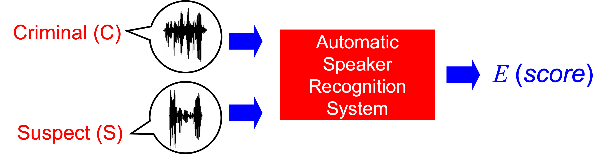
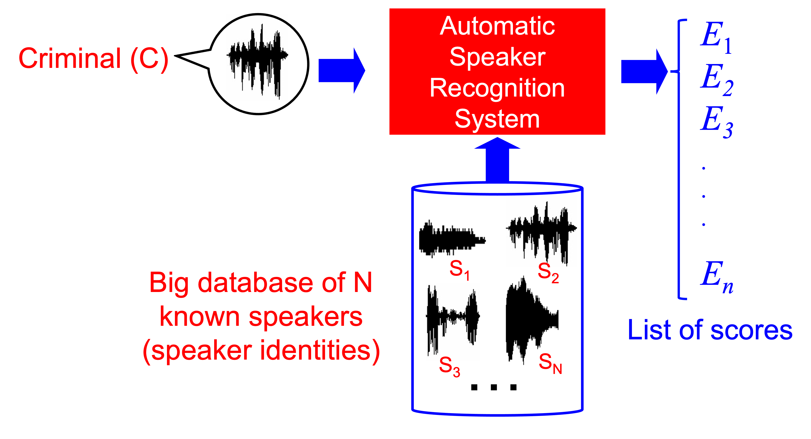
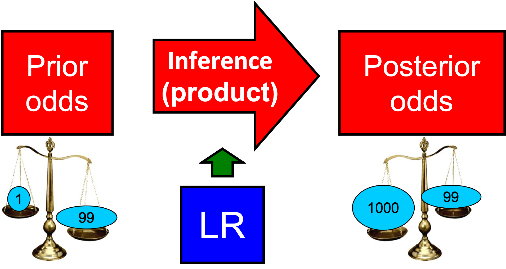
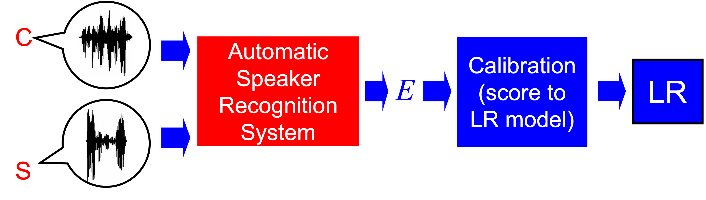

# Forensic Speaker Recognition

## Introduction to Forensic Speaker Recognition

Forensic speaker recognition (also known as Forensic voice comparison) aims at conducting speaker recognition methods to aid a judge or a jury in a judicial trial. In that sense, the word *forensic* refers to the use of scientific or technological methods in legal proceedings. Indeed, forensic is popularly misunderstood as referred to violent crimes involving murders or homicides, maybe because our exposition to movies and TV shows. But the meaning of the word is much wider.

There are two main applications of forensic science. The first one is the so-called *investigative* forensic science, and the second one is the so-called *evaluative* forensic science. Investigative forensic science is intended as the use of science and technology to aid police investigations, i.e., roughly speaking, the process that undergoes from the inspection of a crime scene to the arrestment of a suspect, or the finding of a suspicious item. The evaluative forensic science comes into play when the collected evidence in the investigative stage is used to aid a judge or a jury in the decision process that is the objective of a judicial trial (for instance, by answering to the question "Is the suspect innocent or guilty?").

An example is given here in order to settle these ideas. Imagine a case where there is a person (known as the *offender*) who sneakly steals some items from a house, an action that is deemed a criminal offence by a given justice system. At a first glance, the author of the crime is not known, and the police has not a clue of who could be the author. Then, the owners in the house call the police and fill a formal police report, which starts the police investigation of the crime.

- From the beginning of the first actions of the police, the forensic processs starts in the *investigative* stage. In this stage, the police acts in a coordinated way with the corresponding justice system, typically through the leadership of a judge. Thus, with the authorization of the judge, the police enters the house and evaluates the crime scene looking for clues (a process known as Crime Scene Investigation, or CSI, also a well known acronym because of the TV shows). Imagine that the person who stole the house inadvertidly left a fingermark in one of the places where the stolen items were stored. The police then uses the adequate techniques to reveal the fingermark, and to store it in some way (e.g., by means of a high-resolution picture). Then, the fingermark is compared to the fingerprints of the people living in the house, acquired via an ink impression on paper, or using a livescan device. The police check that there are substantive differences between the fingermark and all the fingerprints of the people living in the house, leading the police to consider that the fingermark is undoubtly from the offender. The fingerprint is then submitted to a forensic laboratory in order to look for a suspect. In the forensic laboratory (which is frequently part of the police force, but not always), the fingerprint is compared to a database of fingers using a so-called Automated Fingerprint Identification System (AFIS). These systems search into a big database of registered fingerprints looking for high similarities (AFIS systems are also very popular amongst lay people, again, due to TV shows and movies). The AFIS yields a list of candidates, i.e. fingerprints that are very close as the fingermark found in the crime scene (also known as *query* or *probe*). Due to this ranked list, the police has a much closer list of potential offenders to consider. Then, the police evaluates other information related to the crime (alibies, eyewitnesses, criminal records) for those candidates, and finally, the police arrests a suspect, and she or he is registered in the judicial system. The investigative stage has ended.

-  Then, the forensic process follows on with the *evaluative* stage. Now, the judge has a suspect, and therefore appoints a date to start the judicial trial, where it will be decided whether the suspect is the author of the fingermark at the crime scene or not. In order to make this decision, the judge has two main sources of information. The first one is the *forensic evidence*, in the form of the fingermark found at the crime scene and fingerprint impressions from the suspect. The second one is all the rest of information reported by the police from the investigative stage (criminal record, eyewitnesses, etc.). The aim of this forensic evaluative stage is to compare the fingermark with its corresponding fingerprint. However, judges cannot compare both pieces of the evidence themselves, since they do not have the competence. Therefore, the judge subordinates this task to a so-called forensic practitioner, who has the competence to conduct the forensic evaluation of the evidence (who will be typically a policeman, an employee of a public or private forensic laboratory, or an individual practicioner. It vastly depends on the country and the legal system). From the process of comparison, the judge receives a forensic evaluative report, that allows him (or a jury) to make their decision. Of course, during this decision process, the judge could call any of the agents to give their testimony (witnesses and suspects, of course, but also the forensic practitioner) and to clarify their ideas towards a decision.

This example on fingerprints and fingermarks could be easily extrapolated to speech signals. Typical cases where speech evidence can be collected are hidden microphones, wire-tapped phone calls, recorded videos or messages in a voicemail. We will called this speech material the *questioned* or *unknown* speech. If the speech collected in any of these situations contains incriminating cues, an investigation may start, and it may end up with a suspect being apprehended and judged. Then, some speech materials will be recorded by the suspect, which we will call *suspect* or *known* speech. In the evaluative stage, a comparison is conducted by the practitioner between the questioned and suspect speech materials, and a report with conclusions is sent back to the judge.

The fact is that speech evidence is very common in criminal trials. This has motivated that many forensic laboratories have invested in the personnel and the infrastructure neccesary to conduct forensic speech science. However, the methods used to analyze the speech in order to gather information at the investigative or evaluative stages are extremely diverse. Some examples are given below:

- In an early past of forensic speech science, we could find so-called *voiceprint* methods, aiming at comparing spectrograms or even waveforms in order to visually find *matching* features between the voice of the suspect and the voice of the offender. Despite this is the preferred method to be exposed in TV shows and movies (perhaps because it resembles what is done with fingerprints), it has been widely discarded as a valid method, since the features that distinguish people from their voices are not easily perceived visually, and also there is strong speech variability that can cheat the human eye and that may have nothing to do with the speaker identity. For instance, two spectrograms or waveforms of two speech excerpts may look similar because of many factors that might have nothing to do with the speaker identity, such as a similar background noise in the questioned and suspect speech. Also, finding a so-called *match* between spectrograms or waveforms is basically chimeric precisely because all this variability. Therefore, this method is strongly not recommended.

- There are so-called auditory methods, where a practicioner directly listens to the voices, and generates a report according to experience. These methods are becoming less and less used, because they are opaque, impossible to scrutinize (beyond believing the practitioner or not), and prone to subjetivity, biases, and intepretation errors. Also, this method is strongly not recommended.

- There are also so-called *human-based phonetic-acoustic* methods, where the practitioner is typically a computational linguist or phonetician, and the analysis is conducted using technical methods based on phonetic-acoustic features that can be extracted from the speech signal. Typical features that are extracted within this category of methods include formant frequencies, bandwidths and trajectories, but many other linguistic and phonetic information may be also used. The practitioner is typically assisted by computer programs that help with the extraction of those features (such as formant trackers, or noise cleaners), but those features are often selected by the phonetician manually. Then, the comparison is performed following some statistical model, sometimes automated by another computer program; or even giving a somewhat subjective match/non match decision (the latter is not recommended for reasons explained below in this chapter). Although there is strong computational support, the whole process requires of an expert phonetician or linguist, and many of the design decisions and the reporting remain strongly human-based.

- Finally, there are automatic and semi-automatic methods, based on the use of an automatic speaker regonition system, which compares two speech materials by automatic means. Alternatively, a semi-automatic speaker recognition system requires a previous stage of feature extraction, that can involve human interaction. However, the algorithms to perform the comparison are fully automated. The practitioner can then evaluate the evidence typical with a statistical model, or even giving a somewhat subjective match/non match decision (the latter is not recommended for reasons explained below in this chapter).

In this chapter, we will only consider automatic methods. Semi-automatic methods are an easy extension of automatic methods, with the difference that the system is fed by audio that has been firstly manipulated by humans (typically to perform voice activity detection, artifact removal or target speaker segmentation). But both kind of systems have the same architecture for the purposes of the chapter.

We will not consider human-based phonetic-acoustic methods because the technology involved in those methods is limited, apart from the tools used by the practitioners for formant tracking to noise reduction. However, those methods are covered in other chapters.


## Challenges in forensic automatic speaker recognition

In forensic science, the conditions of the speech signal are typically very unfavourable. Questioned speech materials often present short duration, uncontrolled acoustic conditions (e.g. reverberation, acoustic environment, etc.), high noise, a high diversity of transmission channels and speech coding schemes (different mobile and landline neworks, voIP, microphone, etc.), varying emotional conditions and vocal efforts, etc.  On the other hand, the suspect speech can also present such variability, since the conditions of the known recordings can be as diverse as non-incriminating wire-taps where the suspect admits to be the author, speech acquired with a high-quality microphone in a room, etc. This environment yields a very variable, and often callenging, mismatch and variability in the conditions of the questioned speech and the suspect speech. Fortunately, modern technologies for speaker recognition handle this variability and this mismatch, but only to some extent. It can be evidenced that the unfavourable conditions typical in a forensic scenario can degrade the perforamnce of the systems deeply. This makes essential to perform a proper validation of the system in forensic conditions, or closely resembling them, prior to its use in casework.

Also, in forensic science the databases are difficult to obtain and to use, even for research purposes. Although the data can plentiful in some forensic laboratories, there are privacy and legal restrictions that make difficult the public access and sharing of big databases in real forensic conditions. This implies a burden in the progress of the area, in some way. 

## Basic architecture of an automatic speaker recognition system

The typical speaker recognition system computes a *score* from the comparison of two speech materials. One of the materials will be questioned speech from a criminal. The other materials will be speech from the suspect. For the purposes of this chapter, the architecture is summarized as follows.




The score is coputed by all the techniques that have been explained elsewhere, namely Gaussian Mixture Models, Probabilistic Linear Discriminant Analysis, i-Vectors, x-Vectors, and so on. However, for the purposes of this chapter, we will talk about forensic applications of those systems, not about the inner workings of the systems. Therefore, for our purposes, the described basic architecture will be more than enough.

By convention, the score is typically interpreted in the following way: a higher score indicates that the two voices are more likely to have been generated by the same speaker. A lower score indicates that the two voices are more likely to have been generated by different speakers. Notice that the words *higher* and *lower*, instead of *high* and *low*, are used. This is because a score does not has to lay in a pre-defined or normalized range. The only and most important property of a score is the so-called *discriminating power*, i.e., the ability to distinguish between pairs of voices that come from the same person, and different people. To this purpose, the range of variation of the scores of a system is completely arbitrary, or even irrelevant. In other words, it does not matter if a system outputs scores between 0 and 1, or between 5000 and 1000000. The important thing is that the same-person scores will be higher than the different-people scores, and *vice-versa*.

Of course, the scores computed by any system will not be perfect, and some comparisons between speech materials coming from the same person may yield a lower score than some other comparisons between speech materials from different people (and *vice-versa*). This is normal in real-life systems: every system makes *errors*. However, it is more true in forensic sience, considerint the typically unfavourable conditions of the speech. Thus, although this behaviour is to be avoided, perfection does not exist, and we have to admit some of these *errors* in real-life operation.

It is important to remark that forensic speaker recognition is substantially different from speaker verification (or authentication). In speaker verification, explained elsewhere, the score is compared to a threshold in order to make decisions among same-people and different-people hypotheses. This is one way to use speaker recognition, typical in security applications (authentication, or access control, a.k.a. voice biometrics) or in commercial ones (characterizing speakers for marketing issues). In these speaker verification systems, the typical errors are false acceptances (a.k.a. false positives) and false rejections (a.k.a. false negatives). The threshold is optimized to cope with a detection cost function, typically, and decisions are made in accordance.

However, speaker verification is not suited for forensic applications. The correct way to use this basic architecture for forensic purposes is shown below, both for investigative and for evaluative purposes.


## Forensic speaker recognition in investigating applications

The basic architecture of a speaker recognition system is typically used for investigating applications, in order to obtain ranked lists of candidate speakers from a stored database of known recordings. The main aim of these systems are to incriminate a suspect prior to arresting them, or to reduce a list of candidates for a trial. This mimics the use of other biometric systems such as the widely extended AFIS systems for fingerprints. This operation mode is called *speaker identification* in the speaker recogniton literature, and then, by analogy with fingerprints, we could call this set-up as an Automated Speaker Identification System (ASIS).

The way to integrate te basic architecture of the spaker recognition system for investigate purposes is shown as follows.



Although not so popular as AFIS, these so-called ASIS systems are used by many police forces in order to aid the investigations before the evaluations are conducted. They are useful to rank lists of candidates for further investigations, to generate further speaker speech material to be compared on trial, to reduce a potential list of suspects, etc. Of course, after all investigations, it is the judge or jury who have the competence to decide whether the suspect is guilty or innocent. But these systems help in finding and tracking suspects.

It is worth noting that the lack of popularity of ASIS (speaker) with respect to AFIS (fingerprints) is related to the difference in discriminating power of both biometric modalities in forensic science. AFIS perform amazingly well because the very high discriminating power of the comparison of a fingermark with a fingerprint. This is specially true when humans aid systems by extracting the relevant information in the fingermark, and therefore all AFIS use to be semi-automatic. Speech materials in investigations are also typically pre-processed manyally by humans before feeding the ASIS, but the discriminating power of the speech evidence is much lower than for fingerprints in typical forensic scenarios. This lower the interest in ASIS with respect to AFIS.


## Forensic speaker recognition in evaluative applications

The evaluation of the relationship between two pieces of evidence at judicial trials has been the subject of discussion in the past years. From this debate, some recommendations from the European Network of Forensic Sience Institutes (ENFSI) have risen. This organization integrates many of the European forensic laboratories and police forces (not only from the European Union, but also from Switzerland, Norway, etc.). It is then not so difficult to guess that their influence is very relevant. The ENFSI recommendations indicate that the logical way of conducting an evaluation of two evidential materials, also for speech, is by a so-called likelihood-ratio framework (or LR framework). Then, we will describe it here, keeping in mind that other approaches (not recommended by ENFSI) are possible to generate evaluative reports in forensic sciences.


### The likelihood ratio framework

From a formal logical perspective, the output of a comparison between two speech materials for the purposes of evidence evaluation should be a value that supports any of the hypotheses involved in the forensic case. A likelihood-ratio framework advocates for a logical decision framework, settled in the well known Bayesian decision theory. Consider a forensic case, where the forensic evidence contains the questioned and suspect speech materials. We will use the *variable* $E$ to denote the information extracted from the evidence itself, whose value is known and observed. In the case of semi-automatic or automatic speaker recognition, that information about the evidence is obtained using a speaker recognition system, either in a fully-automatic way (without human intervention), or most commonly, following a semi-automatic way, typically by a human-assisted pre-processing stage of the speech. Therefore, the information that we can obtain from the evidence is just the score using the typical speaker recognition architecture. And that is why we denote the score as $E$.

Also, let  $H_1$ and $H_2$ be the relevant hypotheses, also known as *propositions*, in the forensic case. Then, a judge or a jury must make a decision towards one of the two. There might be more than two propositions in a case, but we will only assume two of them in this chapter, for simplicity. The hypotheses, or propositions, that are relevant for decision in a forensic case might look like this, for instance:

* $H_1$: *The questioned speech and the suspect speech originated from the same person (or source)*
* $H_2$: *the trace and the reference specimens originated from different people* (or sources)

These propositions as they are stated are fairly simple, possible the simplest ones, and are known as *source-level* propositions. There are many other propositions that are possible in a forensic case, such as *The questioned speech was spoken at the phone by the suspect* (which involves the activity of speaking at the phone), or *The questioned speech comes from the suspect's twin brother*. Those can have more consequences from the legal point of view, or they even may complicate the calculations of the evidence evaluation models enormously. But for the sake of illustration, in this chapter our source-level definition of $H_1$ and $H_2$ will be enough. We will say that the hypothesis *variable* $H$ has two values $\{H_1,H_2\}$. This hypothesis variable $H$ is our unobserved variable, also known as *latent* variable. This means that we want to know the value of $H$, but we cannot. Therefore, we need to *infer* its value, i.e., we want to gather the maximum possible information about $H$, and use it in a way that allows us to know more about it.

Finally, there is one further variable to define. Indeed, the most abstract one. Let $I$ be the *background* information available in the case not related to the evidence $E$. This background information may include anything unrelated to the evidence but relevant to the case. It might include eyewitness testimonies, past criminal records of the suspect, circumstances of the case (e.g., previous conflicts between the suspect and victims involved in the crime, etc.), and so on.

In Bayesian decision theory, decisions are made according to the probabilities of the different hypotheses in the light of all the information in the case. In other words, we want the probabilities of the different values of the unknown variable of interest (i.e., the proposition variable $H$), given all the observed information (i.e., the information about the evidence, $E$; and the background information, $I$). We will use the notation $P \left( H = H_1 \left. \right| E,I \right)$ and $P \left( H = H_2 \left. \right| E,I \right)$ to represent those probabilities. $H_1$ and $H_2$, in their simplest form, are mutually exclusive and exhaustive, and therefore $P \left( H_1 \left. \right| E,I \right) = 1-P \left( H_2 \left. \right| E,I \right)$. 

But now, a problem arises. The value of $P \left( H_1 \left. \right| E,I \right)$ (and $P \left( H_2 \left. \right| E,I \right)$ cannot be computed by the judge or jury, because judges and juries cannot evaluate any speech evidence using an automatic speaker recognition system. It is not only out of their proficiency or ability in that task, but also out of their competence in the judicial process. On the other hand, it is the judge or jury who have to make the decision, and no other people. If the value of $P \left( H_1 \left. \right| E,I \right)$ cannot be decomposed in some way, there is no way of separating the evluation of th evidence from the rest of background information of the case. Then, how can this problem be solved?

Fortunately, the well-known Bayes' theorem can be used to decompose these probabilities, and leading to the following expression:


$$\frac{P \left( H_1 \left. \right| E,I \right)} {P \left(H_2  \left. \right| E,I\right)}= \frac{{P \left( {\left. E \right|H_1,I} \right)}}{{P\left( {\left. E \right|H_2,I} \right)}} \cdot \frac{P \left(H_1 \left. \right| I \right)} {P \left( H_2 \left. \right|I \right)} $$

From this equation, we can distinguish the following quentities:

* The prior probabilities $P \left( H_1 \left. \right| I \right)$ and $ P \left( H_2 \left. \right| I \right)$, which are the province of the judge or jury, and that must be assigned by them without considering the information about the evidence $E$. The ratio of the two complementary probabilities is called the *prior odds*, representing the *odds* in favor or against the hypothesis $H_1$. Thus, odds of value $x$ can be interpreted as *it is $x$ times more probable that the hypothesis $H_1$ is true than that $H_2$ is true*, or *the odds are $x$ to 1 in favor of $H_1$*. Odds are also used in gambling, and they are popular because of this fact.

* The posterior probabilities $P \left( H_1 \left. \right| E,I \right)$ and $ P \left( H_2 \left. \right| E,I \right)$, which are also the province of the judge or jury (because they consider the background information as observed information), and that must be stated considering the information about the evidence $E$ and the background information $I$. Again, the ratio of the two complementary probabilities is called the *posterior odds*, and are interpreted in the same way as the prior odds, but in the light of both $E$ and $I$, instead of just $I$.

* The so-called likelihood ratio (LR), which is the ratio of two likelihoods: $P \left( {\left. E \right|H_1,I} \right)$ and $P\left( {\left. E \right|H_2,I} \right)$. Note that htis LR is the magnitude that *updates* the prior odds with the information about the evidence, namely $E$. In other words, if the judge or jury assign some prior odds to the case (i.e., before the evidence is evaluated by the LR), and the LR multiplies those odds, they obtain their posterior odds, and can make the decision. The LR is the province of the forensic practitioner, and judges and juries do not have to compute it. The expression of the LR is therefore:

$$ LR= \frac{{P \left( {\left. E \right|H_1,I} \right)}}{{P\left( {\left. E \right|H_2,I} \right)}} $$

Note that the LR is also conditioned on the background information $I$. But in this case, it is considered in order to set the conditions that $E$ must have. For instance, if we the background information $I$ includes the fact that the suspect speaker is a smoker, and the practitioner thinks that this may have an influence in their method, then the evidence must be evaluated considering speech from smokers in the data used to train the models. We will come to the way to train the models later, but for the moment, just keep in mind that there is not any legal or procedimental inconsistency in conditioning the likelihoods of the LR to $I$.

Thus, in the likelihood ratio (LR) framework, the value of the evidence (e.g., the questioned and suspect speech) is ineed the LR itself, which must be computed by the forensic practitioner. The inferential process is sketched as follows:




This LR-based framework for interpretation presents many advantages:

* It allows forensic scientists to evaluate and report a meaningful value for the weight of the evidence to the court, with a universal interpretation. In that sense, $LR=5$ for instance means that *the evidence supports the hypothesis $H_1$ in $5$ times over $1$*. In other words, it will multiply times $5$ the prior odds. This is equivalent to say that the probaility of $H_1$ given $E$ and $I$ is increased. The higher the value of the LR, the stronger the support to $H_1$, and the higher will be $P \left( H_1 \left. \right| E,I \right)$ for a given value of $P \left( H_1 \left. \right| I \right)$. The same applies to the hypothesis $H_2$ when the LR is lower than 1: it will support $H_2$, diminishing the posterior probability of $H_1$.

* The role of the practitioner and the judge/jury are clearly separated, thus decomposing the information in the case in two sources that can be handled by the competent personnel: the practitioner evaluates the evidence (e.g., computes the LR) and the judge or jury assigns the prior odds and makes the decision.


* Under this framework, probabilities can be interpreted as degrees of belief, allowing the incorporation of subjective opinions as probabilities in the inference process in a clear and scientific way. In other words, the judge or jury can give their prior odds in a totally subjective way, without the need to explicitly compute the probabilies. This is a process that we intrinsically perform as humans in our everyday life, in fact (think about assigning prior odds to rain or not rain next time you leave home, in order to decide if you take your umbrella with you or not).


* The LR value is interpretable on itself, even if the prior odds are not set by judges of juries. It is interpreted as *support* to a previously stated opinion (i.e., the prior odds), due to the analysis of the information in the evidence, $E$. In other words, if the LR$>1$ the evidence will support that $H=H_1$, and if the LR$<1$ the evidence will support that $H=H_2$. It is important to remark that the LR *supports* an opinion about $H$, but the LR *is not* an opinion about $H$. Opinions about $H$ are represented as probabilities of hypothesis, or odds. Therefore, it is not possible to make a decision about the value of $H$ based solely on the value of the LR, because decisions will be taken from posterior probabilities/odds, not from just degrees of support.

* If the process to compute the LR is based on data and a given statistical model, it will be transparent, repeatable and will be able to be scrutinized. Also, if the process is based on automatic systems, lots of evidence evaluation can be performed automatically, allowing easier empirical validation and perforamnce measurement. We will come to this later.


### Using speaker recognition systems in the LR framework

As mentioned before, if we use a speaker recognition system to evaluate the speech evidence in a case, all the information that the system yields about the support to the hypotheses is condensed into a so-called \emph{*score*}, from our standard speaker recognition architecture. Therefore, the interpretation of the speech evidence using speaker recognition systems requires that the score will be first computed by the system, yielding the particular value $E=e$. Then, the score will be interpreted using a likelihood ratio, or in other words, the score is transformed into a LR by the use of some statistic or machine learning model. This process has been also called *score calibration*. It is illustrated as follows.



Therefore, the aim of LR methods with speaker recognition systems is to use a model that transforms scores into LR values in a forensic case. In this section, some of the most common algorithms for LR computation from biometric scores are described.

Some technical issues must be taken into account, such as the fact that most speaker recognition scores lay in a continuous range, leading to a ratio of likelihoods computed from probability density functions, not probabilities. But this *continuous LR* will pefectly fit into the Bayesian decision framework by taking into account this technical issue.

Before describing each score-to-LR method (also known as calibration methods), it must be said that all those methods are statistical models or machine learning algorithms that are trained with some *training* data, also known in forensics as *background* data. These data will be used to compute *training scores*, that will be used to transform the score in the forensic case into the LR. These backgorund data is essential in forensic science, and particularly in forensic speaker recognition. If the background data is not carefully selected, the resulting LR may be a *bad* LR, in the sense that it will lead to *bad* posterior odds. We will talk about that later, but for the moment, it is important to take home that the selection of the background data is a key issue in forensic speaker recognition.


### Generative LR computation from scores

$LR$ computation in forensic speaker recognition has been classically performed by the use of generative techniques modelling separately the numerator and the denominator of the LR, namely $P \left(\left. E \right|H_1, I\right)$ and $P \left(\left. E \right|H_2, I\right)$. This is done by first assigning probability densities to the evidence using same-person training scores to obtain $P \left(\left. E \right|H_1, I\right)$, and assigning probabilitiy densities to the evidence using different-people training scores to obtain $P \left(\left. E \right|H_2, I\right)$. After that, the value of $E$ is particularized to the score in the forensic case (obtained with the speech evidence), and the LR will be the ratio of the two densities particularized to that value.

Designing this score-to-LR transformation may involve the selection of the family of densities to be used. The most straightforward choice for speaker recognition scores could be the Gaussian distribution, obtained via Maximum Likelihood (ML) from the training set of scores. However, this requires that the training scores involved will be consistent with Gaussian probability density functions, which is not typically the case. Fortunately, some score normalization typically used in speaker recognition help to gaussianize the scores, and therefore the Gaussian models use to perform reasonably well when these score normalization are conducted in the speaker recognition system. Other approaches for generative ML fitting includes the use of Kernel Density Functions (a.k.a. Parzen windows), and Gaussian Mixture Models and other parametric distributions. Bayesian models have been also successfuly applied when the training scores are scarce. 


### LR computation using logistic regression

Logistic regression is a well-known machine learning discriminative technique widely used for many classification problems. In the context of forensic speaker recognition, the aim of logistic regression is obtaining the logarithm of the LR, namely $\log(LR)$, as an affine transformation (i.e., shifting and scaling) of the score. To achieve this, logistic regression does not care about the numerator or the denominator of the LR separately. Instead, it optimizes an objective function that indicates if the $\log(LR)$ is a good one or not. This objective function is known as the *cross-entropy* function, which is computed using the training scores, and it is widely known in machine learning (for instance, fully connected neural networks for classification are usually trained with the same cross-entropy objective). Thus, the cross-entropy in the training database is optimized following some gradient-descent techniques, and the model is fitted.

Logistic regression is widely used in forensic speaker recognition because of its good generalization properties, simplicity and performance.


### Pool Adjacent Violators (PAV) score-to-LR transformation

Another approach to compute a LR from a score has been proposed by the use of the Pool Adjacent Violators (PAV) algorithm, which can be trained to transform a set of scores into a set of LR values presenting optimal performance in the training set. Thus, a PAV transformation can be trained on the set of training scores, and then applied to a score in a forensic case. There are also variants of PAV, inspired in Bayesian methods, that limit the strength of the resulting LR (i.e., the value of $|\log(LR)|$), an effect which is often desirable in forensic science. Because of the latter, these variations of PAV are common in situations where the training scores are scarce.


### Performance of LR methods

In order to evaluate the evidence, LRs must be computed from scores in forensic speaker recognition using automatic or semi-automatic systems. However, this is not enough. The computed LR must *perform well*. In the Bayesian decision framework, this means that the computed LR must lead to probabilities that allow good decisions.

At the source level, performance measurement is typically conducted in an empirical way. In order to measure the performance of a LR method, a *test* set of LR values should be generated by comparisons of speech segments from a *test* database of known identities using the LR method whose performance is to be measured. These comparisons are in fact simulated cases, and therefore the conditions of speech should be similar to the conditions of the evidence speech in the case scenario whose performance is to be measured. This would lead to a set of same-source test LRs and different-source test LRs.

A solution to measure the performance of likelihood ratio values has been proposed for forensic speaker recognition, and has been dubbed *log-likelihood-ratio cost*, or $C_{llr}$. This value is a particular case of the cross-entropy function, which was previously mentioned. Thus, $C_{llr}$ can be also used to optimize discriminative LR coputation algorithms (such as logistic regression).

$C_{llr}$ is a scalar value can be easily computed from a database of test LRs, computed as mentioned before. The higher its value, the worse the performance of the forensic speaker recotnition system. Furthermore, there is a *ceiling* value of $C_{llr} = 1$ for the performance, and if a forensic speaker recognition system presents a $C_{llr} > 1$ on a given test set of LR values, then the system is not reliable in the conditions of those test LRs, and must be discarded. In other words, using those LR to compute posterior odds will tend to lead to worse decisions than using the prior odds solely.

With proper performance metrics, it is possible to conduct the validation of the forensic LR method, understood as the decision about whether a forensic speaker recognition method is ready to be used in casework. However, this is a wide topic that is under the scope of this chapter.

## Further reading

* A work on the use of speaker recognition systems in forensic science, from a statistical perspective {cite}`geoffrey2020statistical`

* A work about how to use biometric systems in forensic science is {cite}`meuwly2012forensic`

* A seminal paper on forensic speaker recognition under the LR framework is {cite}`champod2000inference`


* An introductory work on the importance of the LR framework in forensic speaker recognition is: {cite}`gonzalez2007emulating`

* A validation methodology for LR method, including performance measurement, has been published here: {cite}`meuwly2017guideline`  and here: {cite:t}`ramos2020validation`

  
## References  

```{bibliography}
:filter: docname in docnames
```
