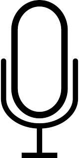
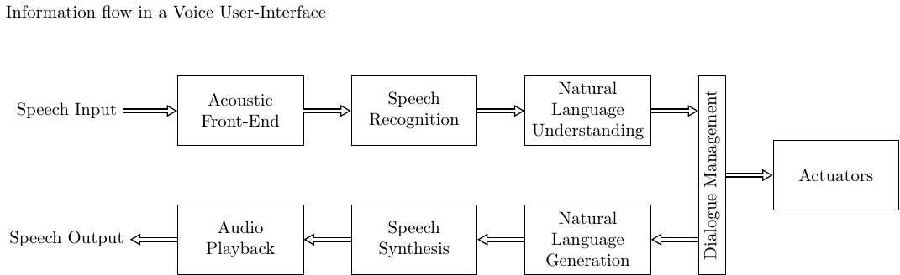

# Applications and systems structures

## Applications

Speech processing is used in, for example;

-   Telecommunication  
    -   Phones and mobile phones
    -   Teleconferencing systems
    -   Voice-over-IP, like
        [Skype](https://en.wikipedia.org/wiki/Skype), [Google
        Hangouts](https://en.wikipedia.org/wiki/Google_Hangouts),
        [Facetime](https://en.wikipedia.org/wiki/FaceTime),
        [Zoom](https://en.wikipedia.org/wiki/Zoom_Video_Communications)
    -   Podcasts, digital radio and TV
    -   Virtual reality and gaming applications
-   Speech operated virtual assistants, like
    [Siri](https://en.wikipedia.org/wiki/Siri),
    [Alexa](https://en.wikipedia.org/wiki/Amazon_Alexa), [Google
    Assistant](https://en.wikipedia.org/wiki/Google_Assistant),
    [Mycroft](https://en.wikipedia.org/wiki/Mycroft_(software)),
    [Cortana](https://en.wikipedia.org/wiki/Cortana_%28software%29) etc.
    -   Also speech interfaces of robots
-   Navigators with speech feedback, like
    [TomTom](https://en.wikipedia.org/wiki/TomTom) and
    [Garmin](https://en.wikipedia.org/wiki/Garmin)
-   Automated telephone services (like the helpdesk of an airline)
-   Automated transcription
    -   Youtube subtitles
    -   Recorded notes from doctors
-   Microphones and microphone systems
    -   Headsets, with or without noise attenuation, with or without
        active noise cancelling
    -   Stage microphones (related to audio processing)
-   Studio recording systems (related to audio processing)  
    -   [Autotune](https://en.wikipedia.org/wiki/Auto-Tune)
    -   Noise attenuation/reduction
-   Dubbing movies e.g. for translation of audio
    -   Also on-line translation
-   Speech synthesis services
    -   Automated e-book readers
    -   User-interfaces for the blind and the handicapped
-   Less common applications  
    -   Access control and fraud detection with speaker identification
        and verification
    -   Anonymization and obfuscation (e.g. witness protection) of
        speech signals
    -   Speech synthesizers for disabled people (e.g. Stephen Hawking)
    -   Medical analysis of speech signals (e.g.
        [Alzheimer](https://en.wikipedia.org/wiki/Alzheimer%27s_disease)
        detection)

Such applications can be categorized according to functionality, roughly
as:

-   Transmission and storage of speech
    -   Enable communication with a far-away person
-   Speech operated user-interfaces
    -   Enable spoken interaction with a machine
-   Information extraction from a speech signal
    -   Like automated transcription to generate subtitles for movies
-   Speech synthesis, i.e. automated generation of speech
-   "Improvement" of a speech signal, such as  
    -   Such as noise reduction, translation

Note that these categories are in many senses overlapping; for example,
noise reduction can be a part of any speech processing system and
information extraction is practically a mandatory part of speech
operated user-interfaces.

## Systems structures

### Transmission and storage

The objective of speech transmission systems is to compress the signal
to as few bits as possible, while keeping the sound quality at the
output as good as possible. This requires that the degradations that we
introduce are chosen such that their perceptual influence is as small as
possible. In other words, we would not like the listener to notice (or
to notice as little as possible) that the signal has been degraded. In
the illustration on the right, at the encoder on the sender side, we
therefore have a model of perceptual importance, which determines how
the signal is quantized. The quantized signal is then compressed to as
few bits as possible. For such compression, we use statistical
information about speech signals.

The decoder at the receiving side, reverses the steps by decompression
and dequantization.

Pre-processing operations would typically include noise attenuation and
voice activity detection (see below).

  

### Information extraction

We can extract many types of information from a speech signal, like
[text content](content:asr) and [speaker
identity](content:sid). Many such forms of
information can be categorized by *labels*, that is, we give a label to
a particular speech signal. That label can be, for example, the word which
was pronounced or the speaker identity. Alternatively, such extracted
information can be continuous-valued, such as the age of the speaker or
mood (how glad/angry are you?), but we can treat both types of
information as labels.

Such information extraction methods are today predominantly machine
learning methods. A typical configuration is illustrated on the right,
where the systems is trained off-line with a database of speech and
corresponding labels. Once the system has been trained, it "knows" how
to derive labels from speech input, such that in the actual use
(application) of the model, it can classify input speech to give an
estimate of the label.

In many cases, information extraction can also be implemented as a
signal processing task, where we use prior knowledge of the signal to
device our algorithm. For example, for estimating the [fundamental
frequency](content:f0) (pitch) of a speech signal, we can
readily use our knowledge to device efficient algorithms. Such
algorithms are usually an order of magnitude simpler than machine
learning methods, but if the task is complicated, then the accuracy of the
output is reduced correspondingly.

## Speech synthesis

When we want to make a computer speak, we need a speech synthesiser,
which takes text as input and outputs speech. It is thus the reverse of
the information extraction -task, in that the roles of speech and labels
(text) have been switched (see figure on the right). As in information
extraction, also here we can also use simpler methods when applicable.
The classical method is concatenative synthesis, where segments of
speech, from a database, are fused together to form continuous
sentences. Such methods are common for example in public announcement
systems (e.g. train stations), where the range of possible announcements
is known in advance.

## User-interfaces

User interfaces can employ speech to accept speech commands and/or
respond with speech. For example,

-   A car navigator can give instructions with speech, while accepting
    commands only through the touch (tactile) interface.
-   An automatic door can accept speech commands ("Door, open") but give
    no audible feedback.
-   Fully speech operated interfaces, like smart speakers, both accept
    speech commands and give spoken feedback.

The unidirectional systems with only speech recognition or only speech
generation are thus subsets of "full" speech operated systems. The stack
of modules of such a complete speech operated system is illustrated on
the right. Here the acoustic front-end (can) contain such pre-processing
methods described in the following section. Natural language
understanding assigns meaning to a sequence of words, dialogue
management maps that to a specific action, implemented by the
actuator(s), and natural language generation refers to the generation of
an answer, in text form.

## Processing and preprocessing

Irrespective of the application, most systems that operate with speech
signals suffer from similar types of problems:

-   The main application is expensive to run, so it would be useful to
    have a pre-processing unit which detects when it makes sense to
    trigger the main application. For example, when nobody is speaking,
    it does not make sense to run a speech recognizer.
-   Devices are used in real-world environments, where background noises
    and room echo are common. It would therefore be useful to clean up
    the signal prior to feeding to the main application.

Such functions typically constitute the acoustic front-end.

### Voice activity detection

When there is no speech, most speech processing operations are
meaningless. [Voice activity detection](content:vad)
refers to the classification of signal segments according to whether
they contain speech or not.

### Keyword spotting or Wake-word detection

In most practical situations where voice operated devices are present,
we want to be able to talk with people and not only the device. In other
words, we need to know when the user is speaking to the device and when
not. The device then doesn't have to try make sense of speech which is
directed to someone else. Wake-word detection (or spotting) refers to a
process which is just waiting for a specific word, which triggers the
main application. For example, smart speakers of the Amazon Alexa brand
wait for the user to say the wake-word "Alexa", and only after
identifying that word, it starts the main process.

### Speech enhancement

We can try to remove the detrimental effect of background noises and
room echoes with speech enhancement methods. Imagine for example how
difficult it is to understand someone on the phone, when the remote
speaker is standing on a busy street loud cars driving by. With noise
attenuation we can reduce such noises to make speech more pleasant to
listen at the receiving end. Also any other processing becomes simpler
if the speech signal is more clean. Thus a voice user-interface can
feature noise attenuation as pre-processing. Note however that also
other processes such as voice activity detection and wake-word detection
become easier on the clean signal (see alternative 1 in the figure on
the right). However, since noise attenuation can be a computationally
expensive process, it might be better to apply when we already know that
the signal is a speech command (see alternative 2 in the figure on the
right), though this will reduce the accuracy of voice activity and
wake-word detection.

### Other signal processing

Speech signals can be processed further by an array of different
algorithms as desired. For example:

-   Signals can be modified for artistic purposes with tools such as
    auto-tune, where the pitch of a singing voice is modified to match a
    desired pitch.
-   Speech signals can be translated to some other language.
-   The identity of a speaker can be hidden (or spoofed) for security
    purposes like witness-protection, or for illegal activities like
    fraud.

 

