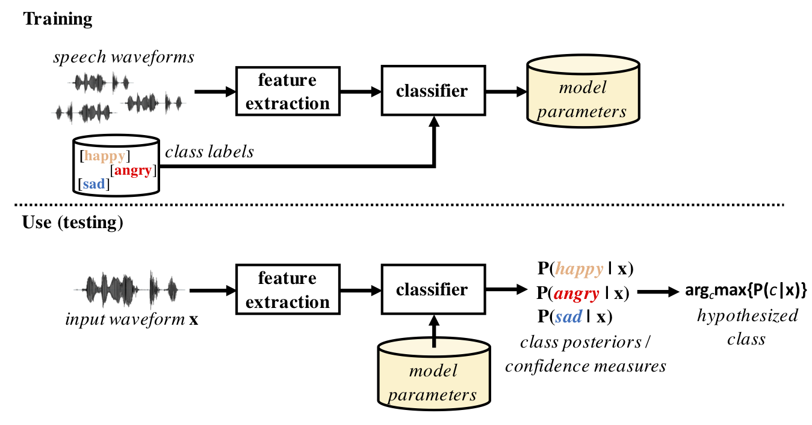
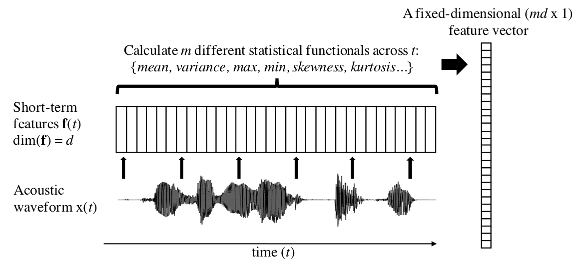
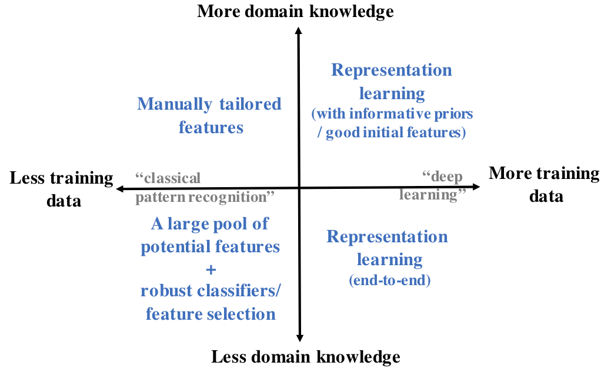

# Paralinguistic speech processing

Paralinguistic speech processing (PSP) refers to analysis of speech
signals with the aim of extracting information beyond the linguistic
content of speech (hence paralinguistic = alongside linguistic
content; see also {cite:t}`schuller2013computational`). In other words, PSP does
not focus on what is the literal transmitted message but on what
additional information is conveyed by the signal. Speaker
[diarization](Speaker_Diarization),
[recognition](Speaker_Recognition_and_Verification), and
[verification](Speaker_Recognition_and_Verification), even though
focusing on non-linguistic aspects, are also traditionally considered as
separate problems that do not fall within the scope of PSP. A classical
example of PSP is speech emotion recognition, where the aim is to infer
the emotional state of a speaker based on a sample of his or her speech.
In a similar manner, information related to the health or age of a
speaker could be inferred from the speech signal.

### Coupling between speaker states and the speech signal

The basic starting point for PSP systems is that the speech signal also
reflects the underlying cognitive and neurophysiological state of a
speaker. This is since speaking involves highly complicated cognitive
processing in terms of real-time communicative, linguistic, and
articulatory planning. In addition, execution of these plans requires
highly-precise motor control of articulators paired with real-time
monitoring of the resulting acoustic signal, and both of these tasks
take place in parallel with further speech planning. The mental state of
the speaker may also affect the manner that the speaker wishes to
express himself or herself.  Finally, the overall physiological
characteristics of the speech production apparatus also shape the
resulting signal, and details of these characteristics may also change
due to illnesses or habits. This means that many temporary or permanent
perturbations in the cognitive and physical machinery of a talker may
show up in the resulting speech.

To give some examples, substantial cognitive load (e.g., a concurrent
attention-requiring task) or neurodegenerative diseases affecting memory
(e.g., Alzheimer's disease) may impact speech planning due to
compromised cognitive resources, resulting in speech output that differs
from the typical speech from the same person in non-stressful or healthy
conditons. In the same way, neurodegenerative diseases affecting the
brain's motor system (e.g., Parkinson's disease) may impact fluidity and
clarity of speech production, and the symptoms will become more
pronounced as the disease progresses. As for articulatory changes,
stress and emotional distress can cause increased tension in the muscles
of the larynx, which can result in tightening of the vocal folds and
therefore also causes increases in the fundamental frequency of speech.
Changes in the physical characteristics of the vocal tract may result
from, e.g., having a cold. In this case, mucus on tract surfaces may
affect resonance and damping characteristics of the vocal tract. In
addition, the mucus may prevent full closing of the velum, causing
nasalized speech often associated with a severe cold. The speaker may
also speak differently due to cognitive fatigue and throat soreness due
to the cold. Aging will also change the characteristics of the speech
production apparatus, not only in childhood but also in later years of
life. These changes are driven by physiological changes in the glottis
and in the vocal tract, where growth of the vocal tract length in early
childhood has an especially pronounced effect. The voice change in
puberty is also an example of quick growth of the larynx and vocal
folds, but small changes in the vocal folds and their control may also
take with later aging.

In addition to information that is not directly related to intended
communicative goals, speech also contains paralinguistic characteristics
related to communication. This is because speech has co-evolved with the
development of other social skills in humans over thousands of years.
Speech (and gestures) can thefore play different types of social
coordinative roles beyond the literal linguistic message transmitted.
For instance, prosody, and speaking style in general, can reflect
different social roles such as submissiveness, arrogance, or authority
in different interactions. Attitudes and emotions showing up in speech
can also be considered as communicative signals facilitating social
interaction and cohesion, not just being speaker-internal states that
inadvertently "leak out" for others to perceive. Demonstration of anger
or happiness through voice can transmit important information regarding
social dynamics even when visual contact between the interlocutors is
not possible. As a concrete example, consider having a telephone
conversation with someone close to you without access to anything else
than the literal message (e.g., substituting the original speech with
monotone but perfectly intelligible speech synthesis) while trying to
communicate highly sensitive and important personal information.  

The basic aim of PSP is to use computational means to understand and
characterize the ways that different paralinguistic factors shape the
speech signal, and to build automatic systems for analyzing and
detecting the paralinguistic factors from real speech captured in
various settings.

Also note that the distinction between PSP systems and other established
areas of speech processing is not always clear-cut. For instance,
automated methods for speech [intelligibility
assessment](Objective_quality_evaluation) are also focusing on
extralinguistic factors, and the task of speaker recognition was already
mentioned at the beginning of this section. In addition, more flexible
control of speaking style is an ongoing topic of research in [speech
synthesis](Speech_Synthesis), where the research focus is gradually
changing from the production of high-quality to speech to creation of
systems capable of richer vocalic expression. However, there is no need
for a strict distinction of PSP from other types of processing tasks,
but PSP can be viewed as an umbrella term for the increasingly many
analysis tasks focused on the various non-literal aspects of spoken
language, and where similar data-driven methodology is usually
applicable across a broad range of PSP phenomena (see also {cite:t}`schuller2013computational`, for a discussion).

### Speaker traits and states

{cite:t}`schuller2013computational`
use a distinction into two types of speaker
characteristics: traits and states. These are related to the temporal
properties of the analyzed phenomena. Speaker traits are long-term and
slowly-changing characteristics of the speaker, such as personality
traits (e.g., Big Five classification), gender, age, or dialect. On the
other hand, speaker states are short- to medium-term phenomena, such as
speaker's emotional state, attitude in a conversation, (temporary)
health conditions, fatigue, or stress level. When collecting data for
PSP research and system development, it is important to consider the
time-scale of the phenomenon to be analyzed and how this relates to
practical needs of the analysis task (e.g., how much speech can be
collected and analyzed before classification decision; does the system
have to be real-time). For instance, quickly changing characteristics
such as emotional state should be analyzed from relatively short speech
recordings where the factor of interest can be assumed to be stable. For
example, recognition of speaker's emotional state during a single
utterance is a widely adopted approach in speech emotion recognition. In
contrast, analysis of speaker health (e.g., COVID-19 symptoms) from just
one utterance is likely to be inaccurate, but speaker-dependent data
collection and analysis across longer stretches of speech will likely
produce more reliable analysis outcomes. Moreover, longitudinal
monitoring of a subject across longer periods of time is likely to be
more accurate in detecting changes in the speaker's voice, as the system
can be adapted to the acoustic and linguistic characteristics of that
specific speaker. For instance, subject-specific monitoring of the
progression of a neurodegenerative disease based on speech is likely to
be more accurate than automatic classification of disease severity from
a bag of utterances from a random collection of speakers.

### Typical applications of PSP 

Some possible applications of paralinguistic tasks include, but are not
limited to:

-   Emotion classification
-   Personality classification (e.g., Big Five traits)
-   Sleepiness or intoxication detection
-   Analysis of cognitive or physical load
-   Health-related analyses (cold, snoring, neurodegenerative diseases
    etc.)
-   Speech addressee analysis (e.g., adult- vs. infant-directed speech)
-   Age and gender recognition
-   Sincerity analysis
-   Attitude analysis

### Basic problem formulation and standard solutions 

The basic goal of paralinguistic analysis is to extract paralinguistic
information of interest while ignoring the signal variability introduced
by other factors, such as linguistic content, speaker identity,
background noise or transmission channel characteristics (aka. *nuisance
factors*). However, for some tasks, it may also be useful to analyse the
lexical and grammatical content of speech in order to infer information
regarding the phenomena of interest.

Typical PSP systems follow the two classical tasks of machine learning:
classification and regression. In classification, the goal is to build a
system that can assign a speech sample (e.g., an utterance) into one of
two or more categories (e.g., intoxicated or not intoxicated). In
regression, the target is a continuous (or at least ordinal) measure
(e.g., blood alcohol concentration percentage).

Fig. 1 illustrates a standard PSP system pipeline, which follows a
typical supervised machine learning scenario. First, a number of
features are extracted from the speech signal. These features, together
with the corresponding class labels, are then used to train a classifier
model for the training dataset. During testing and actual use of the
system, the classifier is used to determine the most likely class of an
input waveform. Depending on the classifier architecture, the
classification result may or may not be associated with a confidence
measure of the classification decision. In regression tasks, the process
is otherwise the same, but the categorical class labels are replaced by
continous-valued measures and the classifier is replaced by a regression
model.

A central characteristic of many PSP tasks is that the analyzed
phenomenon (e.g., speaker emotion) is assumed to be fixed at a certain
time-scale, such as across one utterance, and therefore classification
decisions should also be made at time-scales longer than typical
frame-level signal features. In this case, it would desirable to obtain
a fixed-dimensional feature representation of the signal even if the
duration of the input waveform varies from case to case. This can be
achieved by a two-step process: **1)** first extracting regular
frame-level features (e.g., spectral features such as FFT) with high
temporal resolution (e.g., one frame every 10-ms), sometimes referred to
as low-level descriptors (LLDs), and then **2)** calculating statistical
parameters ("functionals") of each of the features across all the
time-frames (illustrated in Fig. 2). Typical functionals of LLDs
include, e.g., *min, max, mean, variance, skewness,* and *kurtosis*, but
they can also be measures, such as centroids, percentiles, or different
types of means. In order to acquire a more complete picture of the
signal dynamics, first- and second-order time-derivatives of the
frame-level features ("deltas" and "delta-deltas") are often included in
the feature set before calculating the functionals. In neural networks,
a varying-length signal can also be represented by a fixed-dimensional
embedding extracted from the input waveform, such as taking the output
of an LSTM-layer. Once the input signals are represented by
fixed-dimensional feature vectors, standard machine learning classifiers
can be applied to the data.

  



**Figure 1:** An example of a classical PSP processing pipeline with
training (top) and usage (bottom). Speech features are first extracted
from the original speech waveform, followed by a classifier that has
been trained using supervised learning with labeled training samples.

  



**Figure 2:** An example signal-level feature extraction process where
variable-duration utterances become represented by fixed-dimensional
feature vectors, consisting of statistical parameters ("functionals")
calculated across frame-by-frame speech features (sometimes also
referred to as low-level descriptors, or "LLDs").  

  

In the both cases of classification and regression, the challenge is to
build a system that can discriminate the key features of the phenomenon
without being affected by the other sources of signal variability.
High-performance well-generalizing systems can be approached with three
basic strategies: *well-designed features*, *robust classifiers*, or
*end-to-end learning*, where signal representations ("features") and
classifiers are jointly learned from the data. Selection of the approach
depends on two primary factors:  domain knowledge and availability of
representative large-scale training data (Fig. 3).

The basic principle is that well-designed or otherwise properly chosen
features require less training data for inference of the machine
learning model parameters, but this necessitates that the
acoustic/linguistic characteristics of the analyzed phenomenon are known
in order to design features that capture them. If there are only limited
data and limited domain knowledge, it is still possible to calculate a
large number of potentially relevant features and then use a classifier
such as Support Vector Machines (SVMs; Boser et al., 1992) that can
robustly handle high-dimensional features, including potentially
task-irrelevant or otherwise noisy features. For instance, the baseline
systems for annual Computational Paralinguistic Challenges (see also
below) have traditionally used a combination of more than 6000
signal-level features together with an SVM classifier, and often these
systems have been highly competitive with other solutions.
Alternatively, feature selection techniques may be applied in
conjunction with data labeling to find a more compact feature set for
the problem at hand (see, e.g., {cite:t}`pohjalainen2015feature`). 

If there are plenty of training data available, multilayer neural
networks can be used to simultaneously learn useful signal
representations and a classifier for the given problem. This type of
representation learning can operate directly on the acoustic waveform or
using some standard spectral representation with limited additional
assumptions, such as FFT or log-Mel spectrum. The obvious advantage is
that feature design is no longer needed, and the features and the
classifier are seamlessly integrated and jointly optimized. In addition,
even if domain knowledge would be available, the assumptions built into
manually tailored features may lose some details of the modeled
phenomenon, whereas end-to-end neural networks can potentially use all
the information available in the input signal. Similarly to many other
applications of machine learning, neural networks can therefore be
expected to outperform the "more classical" approaches if sufficient
training data are available for the task (see also sub-section below for
data in PSP). However, besides the data requirement drawback, the
standard problems and principles of neural network design and training
apply, including the lack of access to the global optimum during the
parameter optimization process.

If sufficient training data and domain knowledge are both available, one
may also combine representation learning with good initial features or
some type of model priors or constraints. This may speed-up the learning
process or improve model convergence to a more effective solution due to
a more favorable starting point for the optimization process. One
particularly interesting new research direction is the use of
differentiable computational graphs in feature extraction. In this case,
prior task-related knowledge could be incorporated into digital signal
processing (DSP) steps used to extract some initial features, but the
feature extraction algorithm would be implemented together with the rest
of the network as one differentiable computational graph (e.g., using a
framework such as TensorFlow). This would allow error backpropagation
through the entire pipeline from classification decisions to the feature
extractor, thereby enabling task-optimized adaptation of the feature
extraction or pre-processing steps. As an example, Discrete Fourier
Transform is a differentiable function, allowing error gradients to pass
through it, although by default it does not have any free parameters to
optimize. However, similar signal transformations but with parametrized
basis functions could be utilized and optimized jointly with the rest of
the model.

  



**Figure 3:** Basic strategies for PSP system development given the two
main considerations: availability of training data (x-axis) and domain
knowledge (y-axis).

  

Naturally, the division into the four categories described in Fig. 3 is
by no means definite. For instance, recent developments in
self-supervised representation learning (van den Oord et al., 2018;
Chung et al., 2019; Baevski et al., 2020) or multitask learning (e.g.,
Wu et al., 2015) are still largely unexplored in PSP. Such approaches
could enable effective utilization of large amounts of unlabeled speech
data with fewer labeled examples in the target domain of interest.

### Data collection and data sparsity

Since modern PSP largely relies on machine learning, representative
training data will be required for the phenomenon of interest. However,
access to high-quality labeled data is often be limited for many PSP
tasks. First of all, the data collection itself is often challenging and
may include important ethical considerations, such as collecting data
from intoxicated speakers or subjects with rare diseases, or data where
some type of objective (physiological) measurements of emotional state
are captured simultaneously with the speech audio. Availability of
reliable ground-truth labels for the speech data can also be difficult.
For instance, there is no direct way to measure the underlying emotional
states of speakers, whereas induced emotional speech by professional
actors may not properly reflect the variability of real-world emotional
expression. In a similar manner, assessment of severity of many diseases
is based on various indirect measurements and clinical diagnostic
practices, not on some type of oracle knowledge on a universally
standardized scale. Every time humans are used for data labelling (e.g.,
assessing emotions), there is a certain degree of inter-annotator
inconsistency due to differing opinions and general variability in human
performance. This is the case even when domain experts are used for the
task. Naturally, the more difficult the task or more ambiguous the
phenomenon, the more there will be noise and ambiguity in the labeling. 

Another limitation hindering PSP progress is that many PSP datasets
cannot be freely distributed to the research community due to data
ownership and human participant privacy protection considerations. As a
clear example, speech with metadata related to factors such as health or
IQ of the speakers is highly sensitive in nature, and not all speakers
consent to open distribution of their identifiable voice together with
such private data of themselves. The data ownership considerations
inherently limit the pooling of different speech corpora in order to
build more comprehensive databases of speech related to different
phenomena of interest, and generally slow down replicable open science.
On the other hand, it is of utmost importance to respect the privacy of
human participants in PSP (or any other) research—not only due to
ethical considerations, but also since the entire field depends on
access to data from voluntary human participants. Commercial interests
to data ownership are also often unavoidable.

In total, this means that data is often a limiting factor in system
performance, and therefore deep neural networks have still not become
the only off-the-shelf-solution for many PSP problems. Efforts for more
flexible (but ethical) data sharing and pooling is therefore an
important challenge for future research. More powerful technical
solutions and deeper understanding of the PSP phenomena could be
acquired by combining rich data (and metadata) from various sources,
including different languages, cultural environments, and recording
conditions. 

### Computational Paralinguistic Challenge 

Research in PSP has been strongly advanced by an annual Computational
Paralinguistic Challenge (ComParE) held in the context of ISCA
Interspeech conferences (see <http://www.compare.openaudio.eu/>). Every
year since 2009, ComParE has included a number of paralinguistic
analysis tasks with pre-defined datasets in which participants can
compete with each other. Competitive baseline systems, evaluation
protocols and results are always provided to the participants as a
starting point, enabling low-barrier access to the world of PSP for
researchers with various backgrounds. In addition, new tasks and
datasets can be proposed to challenge organizers, providing a useful
channel for data owners and researchers to obtain competitive solutions
to their analysis problems.

## Further reading and materials on PSP 

{cite:empty}`eyben2010opensmile,baevski2020wav2vec,chung2019unsupervised,boser1992training,wu2015deep`


```{bibliography}
:filter: docname in docnames
```

Schuller, B. et al.: Computational Paralinguistic Challenge. WWW-site:
<http://www.compare.openaudio.eu/>, last accessed 11th October 2020.


