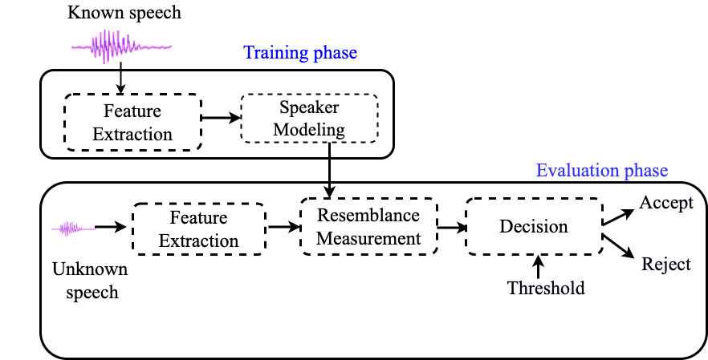
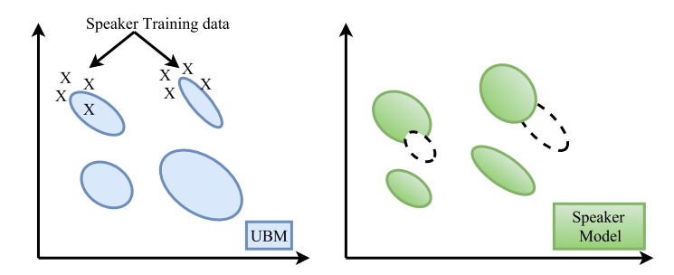
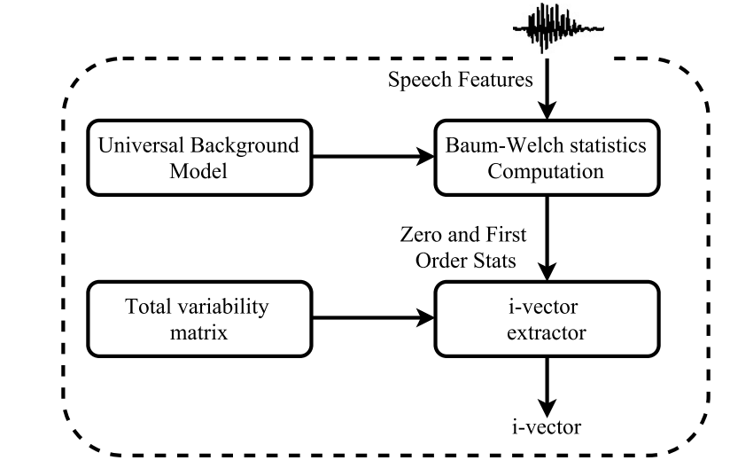

# Speaker Recognition and Verification

## Introduction to Speaker Recognition

Speaker recognition is the task of identifying a speaker using their
voice. Speaker recognition is classified into two parts: speaker
identification and speaker verification. While speaker identification is
the process of determining which voice in a group of known voices best
matches the speaker’, speaker verification is the task of accepting or
rejecting the identity claim of a speaker by analyzing their acoustic
samples. Speaker verification systems are computationally less complex
than speaker identification systems since they require a comparison
between only one or two models, whereas speaker identification requires
comparison of one model to N speaker models.

Speaker verification methods are divided into text-dependent and
text-independent methods. In text-dependent methods, the speaker
verification system has prior knowledge about the text to be spoken and
the user is expected to speak this text. However, in a text-independent
system, the system has no prior knowledge about the text to be spoken
and the user is not expected to be cooperative. Text-dependent systems
achieve high speaker verification performance from relatively short
utterances, while text-independent systems require long utterances to
train reliable models and achieve good performance.

Block diagram of a basic speaker verification system

As it is shown in the above block diagram of a basic speaker
verification system, a speaker verification system involves two main
phases: the training phase in which the target speakers are enrolled and
the testing phase in which a decision about the identity of the speaker
is taken. From a training point of view, speaker models can be
classified into generative and discriminative. Generative models such as
Gaussian Mixture Model (GMM) estimate the feature distribution within
each speaker. Discriminative models such as Support Vector Machine and
Deep Neural Network (DNN), in contrast, model the boundary between
speakers.

The performance of speaker verification systems is degraded by the
variability in channels and sessions between enrolment and verification
speech signals. Factors which affect channel/session variability
include:

1.  Channel mismatch between enrolment and verification speech signals
    such as using different microphones in enrolment and verification
    speech signals. 

2.  Environmental noise and reverberation conditions. 

3.  The differences in speaker voice such as ageing, health, speaking
    style and emotional state.

4.  Transmission channel such as landline, mobile phone, microphone and
    voice over Internet protocol (VoIP).

## Front-end Processing

Many front-end processing are often used to process the speech signals
and to extract the features which are used in the speaker verification
system. The front-end processing consists of mainly voice activity
detection (VAD), feature extraction and channel compensation techniques;

1.  [Voice activity detection (VAD)](Voice_activity_detection.ipynb);
    The main goal of voice activity detection is to determine which
    segments of a signal are speech and non-speech. A robust VAD
    algorithm can improve the performance of a speaker verification
    system by making sure that speaker identity is calculated only from
    speech regions. Therefore, it is necessary to review the VAD
    algorithm to overcome the problems in designing a robust speaker
    verification system. The three widely used techniques for VAD are
    the following: energy based, model based and hybrid approaches.
2.  Feature extraction techniques are used to transform the speech
    signals into acoustic feature vectors. Thus, the extracted acoustic
    features should carry the essential characteristics of the speech
    signal which recognizes the identity of the speaker by their voice.
    The aim of feature extraction is to reduce the dimension of acoustic
    feature vectors by removing unwanted information and emphasizing the
    speaker-specific information. The MFCCs are commonly used as the
    feature extraction technique for the modern speaker verification.
3.  Channel compensation techniques are used to reduce the effect of
    channel mismatch and environmental noise. Channel compensation can
    be used in different stages of speaker verification such as feature
    and model domains. Various channel compensation techniques such as
    cepstral mean subtraction (CMS) , feature warping, cepstral mean
    variance normalization (CMVN)  and relative spectral (RASTA)
    processing have been used to reduce the effect of channel mismatch
    during the feature extraction phase. In the model domain, Joint
    Factor Analysis (JFA) and i-vectors are used to combat enrolment and
    verification mismatch.

## Speaker Modeling Techniques

One of the crucial issues in speaker diarization is the techniques
employed for speaker modeling. Several modeling techniques have been
used in speaker recognition and speaker diarization tasks. The
state-of-the-art speaker modeling techniques in speaker diarization are
the following:

### Gaussian Mixture Modeling (GMM) - Universal Background Model (UBM) Approach

  

A Gaussian Mixture Model (GMM) is a parametric probability density
function represented as a weighted sum of Gaussian component densities.
GMMs have been successfully used to model the speech features in
different speech processing applications. A Gaussian mixture model is a
weighted sum of M component Gaussian densities. Each of the components
is a multi-variant Gaussian function. A GMM is represented by mean
vectors, covariance matrices and mixture weights.

$$ \lambda = \{w_i, \mu_i, \Sigma_i\}, \quad i=
1,.......,C $$

The covariance matrices of a GMM,  $ \Sigma_i $ , can be full rank
or constrained to be diagonal. The parameters of a GMM can also be
shared, or tied, among the Gaussian components. The number of GMM
components and type of covariance matrices are often determined based on
the amount of data available for estimating GMM parameters.

In speaker recognition, a speaker can be modeled by a GMM from training
data or using Maximum A Posteriori (MAP) adaptation. While the speaker
model is built using the training utterances of a specific speaker in
the GMM training, the model is also usually adapted from a large number
of speakers called Universal Background Model in MAP adaptation.

Given a set of training vectors and a GMM configuration, there are
several techniques available for estimating the parameters of a GMM .
The most popular and used method is the maximum likelihood (ML)
estimation.

The ML estimation finds the model parameters that maximize the
likelihood of the GMM given a set of data. Assuming an independence
between the training vectors $ X = \{x_i,\dots,x_N\} $ , the GMM
likelihood is typically described as:

$$ p(X|\lambda) = \prod_{t=1}^{N} p(x_t|\lambda) (1) $$

Since direct maximization is not possible on equation on equation 1, the
ML parameters are obtained iteratively using expectation-maximization
(EM) algorithm.  The EM iteratively estimate new model parameters  
$\bar{\lambda} $  based on a given model $\lambda$ such that $p(X|\bar{\lambda}) \ge p(X|\lambda) $ . 

Example of
speaker model adaptation

The parameters of a GMM can also be estimated using Maximum A Posteriori
(MAP) estimation, in addition to the EM algorithm. The MAP estimation
technique derives a speaker model by adapting from a universal
background model (UBM). The “Expectation” step of EM and MAP are the
same. MAP adapts the new sufficient statistics by combining them with
old statistics from the prior mixture parameters.

Given a prior model and training vectors from the desired class, $ X =
{x_1 . . . , x_T } $ , we first determine the probabilistic alignment
of the training vectors into the prior mixture components. For mixture 
$ i $ in the prior model  $ Pr(i|x_t,\lambda_{UBM}) $ is
computed as the percentage of the mixture component  $ i $ to the
total likelihood,

$$ Pr(i|x_t,\lambda_{UBM})= \frac {w_i\,g(x_t|\mu_i,\Sigma_i)}
{\sum_{i=1}^{M} w_i\,g(x_t|\mu_i,\Sigma_i)} $$

Then, the sufficient statistics for the weight, mean and variance
parameters is computed as follows:

$$ n_i=\sum_{t=1}^{T}Pr(i|x_t,\lambda_{prior}) \, weight $$
$$ E_i(x)=\frac{1}{n_i}\sum_{t=1}^{T}Pr(i|x_t,\lambda_{prior})x_t
\;\; mean $$ 
$$ E_i(x^2)=\frac{1}{n_i}\sum_{t=1}^{T}Pr(i|x_t,\lambda_{prior})x_t^2
\;\; variance $$

  

Finally, the new sufficient statistics from the training data are used
to update the prior sufficient statistics for mixture  $ i $ to
create the adapted mixture weight, mean and variance for mixture
$i$ as follows:

$$ w_i=[\alpha^w_in_i/T + (1-\alpha^w_i)w_i]\gamma $$ 
$$ \mu_i=\alpha^m_iE_i(x) + (1-\alpha^m_i)\mu_i $$ 
$$ \mu^2_i=\alpha^v_iE_i(x^2) + (1-\alpha^v_i)(\sigma^2_i+\mu^2_i)-\mu^2_i $$

  

The adaptation coefficients controlling the balance between old and new
estimates are  $ \{\alpha^w_i, \alpha^m_i, \alpha^v_i\} $ for
the weights, means and variances, respectively. The scale factor, $
\gamma $ , is computed over all adapted mixture weights to ensure
they sum to unity.

### i-Vectors

Different approaches have been developed recently to improve the
performance of speaker recognition systems. The most popular ones were
based on GMM-UBM. The Joint Factor Analysis (JFA) is then built on the
success of the GMM-UBM approach. JFA modeling defines two distinct
spaces: the speaker space defined by the eigenvoice matrix and the
channel space represented by the eigen-channel matrix. The channel
factors estimated using JFA, which are supposed to model only channel
effects, also contain information about speakers. A new speaker
verification system has been proposed using factor analysis as a feature
extractor that defines only a single space, instead of two separate
spaces. In this new space, a given speech recording is represented by a
new vector, called total factors as it contains the speaker and channel
variabilities simultaneously. Speaker recognition based on the i-vector
framework is currently the state-of-the-art in the field. 

Given an utterance, the speaker and channel dependent GMM supervector is
defined as follows:

$$ M=m+Tw $$

where  $ m $ is a speaker and channel independent supervector,  $
T $ is a rectangular matrix of low rank and  $ w $ is a random
vector having a standard normal distribution $ N(0,1) $ . The
components of the vector  $ w $ are the total factors. These new
vectors are called i-vectors.  $ M $ is assumed to be normally
distributed with mean vector and covariance matrix $ TT^t $ .

The total factor is a hidden variable, which can be defined by its
posterior distribution conditioned to the Baum–Welch statistics for a
given utterance. This posterior distribution is a Gaussian distribution
and the mean of this distribution corresponds exactly to i-vector. The
Baum–Welch statistics are extracted using the UBM.

Given a sequence of L frames  $ \{y_1,y_2,......,y_n\} $ and a
UBM  $ \Omega $ composed of $ C $ mixture components defined in
some feature space of dimension $ F $ , the Baum–Welch statistics
needed to estimate the i-vector mixturefor a given speech utterance  $ u $
is given by :

$$ N_c=\sum_{t=1}^{L}P(c|y_t,\Omega) $$ 
$$ F_c=\sum_{t=1}^{L}P(c|y_t,\Omega)y_t $$

where  $ m_c $ is the mean of UBM mixture component $ c $ .
The i-vector for a given utterance can be obtained using the following
equation:

$$ w=(I + T^t \Sigma^{-1} N(u)T)^{-1}. \,T^t\Sigma^{-1}\hat{F}(u)
$$

where  $ N_u $ is a diagonal matrix of dimension  $ CF \times CF
$ whose diagonal blocks are $ N_cI(c=1,......, C) $ . The
supervector obtained by concatenating all first-order Baum–Welch
statistics $ F_c $ for a given utterance  $ u $ is represented
by  $ \hat{F}(u) $ which has  $ CF \times 1 $ dimension. The
diagonal covariance matrix,  $ \Sigma $ , with dimension $ CF
\times CF $ estimated during factor analysis training models the
residual variability not captured by the total variability matrix $ T
$ .

Process of
i-Vector extraction

One of the most widely used feature normalization techniques of
i-vectors is length normalization. Length normalization ensures that the
distribution of i-vectors matches the Gaussian normal distribution and
makes the distributions of i-vector more similar. Performing whitening
before length normalization improves the performance of speaker
verification systems.  i-vector normalization improves the gaussianity
of the i-vectors and reduces the gap between the underlying assumptions
of the data and real distributions. It also reduces the dataset shift
between development and test i-vectors.

$$ w\leftarrow
\frac{\Sigma^{-\frac{1}{2}}(w-\mu)}{\|\Sigma^{-\frac{1}{2}}(w-\mu)\|}
$$

  
where  $ \mu $ and  $ \Sigma $ are the mean and the covariance
matrix of a training corpus, respectively. The data is standardized
according to  covariance matrix  $ \Sigma $ and length-normalized
(i.e., the i-vectors are confined to the hypersphere of unit radius.

The two most widely and common intersession compensation techniques of
i-vectors are Within-Class Covariance Normalization (WCCN) and Linear
Discriminant Analysis (LDA). WCCN uses the within-class covariance
matrix to normalize the cosine kernel functions in order to compensate
for intersession variability. LDA attempts to define a reduced special
axes that minimize the within-speaker variability caused by channel
effects, and maximize between-speaker variability.

  

#### Cosine Distance

Once the i-vectors are extracted from the outputs of speech clusters,
cosine distance scoring tests the hypothesis if two i-vectors belong to
the same speaker or different speakers. Given two i-vectors, the cosine
distance among them is calculated as follows:

$$ cos(w_i,w_j)=\frac{w_i\cdot w_j}{\|w_i\|\cdot\|w_j\|}\gtreqless
\theta $$

where  $ \theta $ is the threshold value, and  $ cos(w_i,w_j) $
is the cosine distance score between clusters  $ i $ and $ j $ .
The corresponding i-vectors extracted for clusters  $ i $ and  $ j
$ are represented by  $ w_i $ and $ w_j $ , respectively.

The cosine distance scoring considers only the angle between two
i-vectors, not their magnitude. Since the non-speaker information such
as session and channel variabilities affect the i-vector magnitude,
removing the magnitudes can increase the robustness of i-vector systems.

### Probabilistic Linear Discriminant Analysis 

The i-vector representation followed by probabilistic linear
discriminant analysis (PLDA) modeling technique is the state-of-the-art
in speaker verification systems. PLDA has been successfully applied in
speaker recognition experiments. It is also applied to handle speaker
and session variability in speaker verification task. It has also been
successfully applied in speaker clustering since it can separate speaker
and noise specific parts of an audio signal which is essential for
speaker diarization.

  

Example of PLDA model

In PLDA, assuming that the training data consists of $J$
i-vectors where each of these i-vectors belong to speaker $I$,
the $j$’th i-vector of the $I$th speaker is denoted by:

$$ w_{ij}=\mu + Fh_i + Gy_{ij} + \Sigma_{ij} $$

  
where  $ \mu $  is the overall speaker and segment independent mean
of the i-vectors in the training dataset, columns of the matrix F define
the between-speaker variability and columns of the matrix G define the
basis for the within-speaker variability subspace.  $ \Sigma_{ij}
$ represents any unexplained data variation. The components of the
vector  $ h_i $ are the eigenvoice factor loadings and components of
the vector  $ y_{ij} $ are the eigen-channel factor loadings. The
term  $ Fh_i $ depends only on the identity of the speaker, not on
the particular segment.

Although the PLDA model assumes Gaussian behavior, there is empirical
evidence that channel and speaker effects result in i-vectors that are
non-Gaussian.  It is reported in that the use of Student’s
t-distribution, on the assumed Gaussian PLDA model, improves the
performance. Since this normalization technique is complicated, a
non-linear transformation of i-vectors called radial Gaussianization has
been proposed. It whitens the i-vectors and performs length
normalization. This restores the Gaussian assumptions of the PLDA model.

A variant of PLDA model called Gaussian PLDA (GPLDA) is shown to provide
better results.  Because of its low computational requirements, and its
performance, it is the most widely used PLDA modeling. In GPLDA model,
the within-speaker variability is modeled by a full covariance residual
term  which allows us to omit the channel subspace. The generative PLDA
model for the i-vector is  represented by 

$$ w_{ij}=\mu + Fh_i + \Sigma_{ij} $$

The residual term  $ \Sigma $ representing the within-speaker
variability is assumed to have a normal distribution with full
covariance matrix $ \Sigma $ .

Given two i-vectors  $ w_1 $ and $ w_1 $ , the PLDA computes the
likelihood ratio of the two i-vectors as follows:

$$ Score(w_1,w_2)= \frac{p(w_1,w_2|H_1)}{p(w_1|H_2) p(w_2|H_2)}
$$

where the hypothesis  $ H_1 $ indicates that both i-vectors belong
to the same speaker and  $ H_0 $ indicates they belong to two
different speakers.

###  Deep Learning (DL)

  

The recent advances in computing hardware, new DL architectures and
training methods, and access to large amount of training data has
inspired the research community to make use of DL technology again as in
speaker recognition systems.  DL techniques can be used in the frontend
or/and backend of a speaker recognition system. The whole end-to-end
recognition process can even be performed by a DL architecture.

**Deep Learning Frontends:** The traditional i-vector approach consists
of mainly three stages: Baum-Welch statistics collection, i-vector
extraction, and PLDA backend. Recently, it is shown that if the
Baum-Welch statistics are computed with respect to a DNN rather than a
GMM or if bottleneck features are used in addition to conventional
spectral features, a substantial improvement can be achieved. Another
possible use of DL in the frontend is to represent the speaker
characteristics of a speech signal with a single low dimensional vector
using a DL architecture, rather than the traditional i-vector algorithm.
These vectors are often referred to as speaker embeddings. Typically,
the inputs of the neural network are a sequence of feature vectors and
the outputs are speaker classes.

**Deep Learning Backends:** One of the most effective backend techniques
for i-vectors is PLDA which performs the scoring along with the session
variability compensation. Usually, a large number of different speakers
with several speech samples each are necessary for PLDA to work
efficiently. Access to the speaker labeled data is costly and in some
cases almost impossible. Moreover, the amount of the performance gain,
in terms of accuracy, for short utterances is not as much as that for
long utterances. These facts motivated the research community to
look for DL based alternative backends. Several techniques have been
proposed. Most of these approaches use the speaker labels of the
background data for training, as in PLDA, and mostly with no significant
gain compared to PLDA. 

**Deep Learning End-to-Ends:** It is also interesting to train an
end-to-end recognition system capable of doing multiple stages of signal
processing with a unified DL architecture. The neural network will be
responsible for the whole process from the feature extraction to the
final similarity scores. However, working directly on the audio signals
in the time domain is still computationally too expensive and,
therefore, the current end-to-end DL systems take mainly the handcrafted
feature vectors, e.g., MFCCs, as inputs. Recently, there have been
several attempts to build an end-to-end speaker recognition system using
DL though most of them focus on text-dependent speaker recognition.

## Applications of Speaker Recognition

-   Transaction authentication – Toll fraud prevention, telephone credit
    card purchases, telephone brokerage (e.g., stock trading) 

-   Access control – Physical facilities, computers and data networks 

-   Monitoring – Remote time and attendance logging, home parole
    verification, prison telephone usage 

-   Information retrieval – Customer information for call centers, audio
    indexing (speech skimming device), speaker diarization 

-   Forensics – Voice sample matching

## Performance Evaluations

The performance of the speaker verification is measured in terms of
errors. The types of error and evaluation metrics commonly used in
speaker verification systems are the following.

## Types of errors

False acceptance: A false acceptance occurs when the speech segments
from an imposter speaker are falsely accepted as a target speaker by the
system. 

$$ False\; Acceptance = \frac{Total \; number \;of\; false\;
acceptance\; errors} {Total\; number\; of\; imposter\; speaker\;
attempts} $$

  

**False rejection:** A false rejection occurs when the target speaker is
rejected by the verification systems. 

$$ False\;rejection = \frac{Total \;number\; of\; false\;
rejection\; errors} {Total\; number\; of\; enrolled\; speaker\;
attempts} $$

  

## Performance metrics

  

The performance metrics of speaker verification systems can be measured
using the equal error rate (EER) and minimum decision cost function
(mDCF). These measures represent different performance characteristics
of system though the accuracy of the measurements is based on the number
of trials evaluated in order to robustly compute the relevant
statistics. Speaker verification performance can also be represented
graphically by using the detection error trade-off (DET) plot. The EER
is obtained when the false acceptance rate and false rejection rate have
the same value. The performance of the system improves if the value of
ERR is lower because the sum of total error of the false acceptance and
false rejection at the point of ERR decreases. The decision cost
function (DCF) is defined by assigning a cost of each error and taking
into account the prior probability of target and impostor trails. The
decision cost function is defined as: 

$$ DCF = C_{miss}P_{miss}P_{target} + C_{fa}P_{fa}P_{impostor}
$$

where  $ C_{miss} $ and  $ C_{fa} $ are the cost functions of
a missed detection and false alarm, respectively. The prior
probabilities of target and impostor trails are given by  $
P_{target} $ and   $ P_{impostor} $ , respectively. The
percentages of the missed target and falsely accepted impostors’ trails
are represented by  $ P_{miss} $ and $ P_{fa} $ ,
respectively. The mDCF is used to evaluate speaker verification by
selecting the minimum value of DCF estimated by changing the threshold
value. The mDCF can be used to evaluate speaker verification by
selecting the minimum value of DCF estimated by changing the threshold
value.

$$ mDCF = min[C_{miss}P_{miss}P_{target} +
C_{fa}P_{fa}P_{impostor}] $$

  where  $ P_{miss} $ and  $ P_{fa} $ are the miss and false
alarm rates recorded from the trials, and the other parameters are
adjusted to suit the evaluation of application-specific requirements.

 