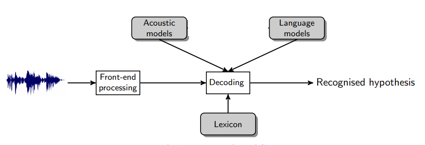

(content:asr)=
# Speech Recognition

  

## Introduction to ASR

  

An ASR system produces the most likely word sequence given an incoming
speech signal.  The statistical approach for speech recognition has
dominated Automatic Speech Recognition (ASR) research over the last few
decades leading to a number of successes. The problem of speech
recognition is defined as the conversion of spoken utterances into
textual sentences by a machine.  In the statistical framework, the
Bayesian decision rule is employed to find the most probable word
sequence, $ \hat H $ , given the observation sequence $ O = (o_1,
. . . , o_T ) $ :

$$ \hat H= \operatorname*{argmax}_H \;P(H|O) $$

Following Bayes’ rule, the posterior probability in the above equation
can be expressed as a conditional probability of the word sequence given
the acoustic observations,  $ P(O|H) $ , multiplied by a prior
probability of the word sequence,  $ P(H) $ , and normalized by the
marginal likelihood of observation sequences, $ P(O) $ :

$$ \hat H= \operatorname*{argmax}_H \; \frac {P(O|H)\;P(H)}
{P(O)} $$ $$ \hat H= \operatorname*{argmax}_H \; P(O|H)\;P(H)
$$

  
The marginal probability, $ P(O) $ , is discarded in the second
equation since it is constant with respect to the ranking of hypotheses,
and hence does not alter the search for the best hypothesis.  $
P(O|H) $ is calculated by the acoustic model and  $ P(H) $ is
modeled by the language model.

  

## Component of ASR

-   Feature Extraction: It converts the speech signal into a sequence of
    acoustic feature vectors. These observations should be compact and
    carry sufficient information for recognition in the later stage.
-   Acoustic Model: It Contains a statistical representation of the
    distinct sounds that make up each word in the Language Model or
    Grammar.  Each distinct sound corresponds to a phoneme.
-   Language Model: It contain a very large list of words and their
    probability of occurrence in a given sequence.
-   Decoder: It is a software program that takes the sounds spoken by a
    user and searches the acoustic Model for the equivalent sounds. 
    When a match is made, the decoder determines the phoneme
    corresponding to the sound.  It keeps track of the matching phonemes
    until it reaches a pause in the users speech.  It then searches the
    language model  for the equivalent series of phonemes.  If a match
    is made, it returns the text of the corresponding word or phrase to
    the calling program. 


Architecture of an ASR system

## Types of ASR

Speech recognition systems can be classified on the basis of the
constraints under which they are developed and which they consequently
impose on their users. These constraints include: speaker dependence,
type of utterance, size of the vocabulary, linguistic constraints, type
of speech and environment of use. We will describe each constraint as
follows:

**Speaker Dependence**: Speaker dependent speech recognition system
requires the user to be involved in its development whereas speaker
independent systems do not. Speaker independent systems can be used by
anybody. Speaker dependent systems usually perform much better than
speaker independent systems. This is due to the fact that the acoustic
variations among different speakers are very difficult to describe and
model. There are approaches to make a system speaker independent. The
first one is the use of multiple representations for each reference to
capture the speaker variation and the second one is the speaker
adaptation approach. 

**Type of Utterance**: A speech recognizer may recognize every word
independently. It may require its user to speak each word in a sentence
separating them by artificial pause or it may allow the user to speak in
a natural way. The first type of system is categorized as an isolated
word recognition system. It is the simplest form of a recognition
strategy. It can be developed using word-based acoustic models without
any language model. If, however, the vocabulary increases sentences
composed of isolated words to be recognized, the use of sub-word
acoustic models and language models become important. The second one is
the continuous speech recognition systems. It allows the users to utter
the message in a relatively or completely unconstrained manner. Such
recognizers must be capable of performing well in the presence of all
the co-articulatory effects. Developing continuous speech recognition
systems is, therefore, the most difficult task. This is due to the
following properties of continuous speech:  word boundaries are unclear
in continuous speech; and co-articulatory effects are much stronger in
continuous speech

**Vocabulary Size**: The number of words in the vocabulary is a
constraint that makes a speech recognition system small, medium or
large. As a rule of thumb, small vocabulary systems are those which have
a vocabulary size in the range of 1-99 words; medium, 100-999 words; and
large, 1000 words or more. Large vocabulary speech recognition systems
perform much worse compared to small vocabulary systems due to different
factors such as word confusion that increases with the number of words
in the vocabulary. For small vocabulary recognizer, each word can be
modeled. However, it is not possible to train acoustic models for
thousands of words separately because we cannot have enough training
speech and storage for parameters of the speech that is needed. The
development of large vocabulary recognizer, therefore, requires the use
of sub-word units. On the other hand, the use of sub-word units results
in performance degradation since they cannot capture co-articulatory
effects as words do. The search process in large vocabulary recognizer
also uses pruning instead of performing a complete search. 

**Type of Speech:** A speech recognizer can be developed to recognize
only read speech or to allow the user speak spontaneously. The latter is
more difficult to build than the former due to the fact that spontaneous
speech is characterized by false starts, incomplete sentences, unlimited
vocabulary and reduced pronunciation quality. The primary difference in
recognition error rates between read and spontaneous speech are due to
disfluencies in spontaneous speech. Disfluencies in spontaneous speech
can be characterized by long pauses and mispronunciations. Spontaneous
is, therefore, both acoustically and grammatically difficult to
recognize.

**Environment**: Speech recognizer may require the speech to be clean
from environmental noises, acoustic distortions, microphones and
transmission channel distortions or they may ideally handle any of these
problems. While current speech recognizer give acceptable performance in
carefully controlled environments, their performance degrades rapidly
when they are applied in noisy environments. This noise can take the
form of speech from other speakers; equipment sounds, air conditioners
or others. The noise might also be created by the speaker himself in a
form of lip smacks, coughs or sneezes. 

## Models for Large Vocabulary Speech Recognition (LVCSR)

LVCSR can be divided into two categories: HMM-based model and the
end-to-end model.

###  HMM-Based Model

The HMM-based model has been the main LVCSR model for many years with
the best recognition accuracy. An HMM-based model is divided into three
parts:acoustic, pronunciation and language model. In HMM based model,
each model is independent of each other and plays a different role.
While the acoustic model models the mapping between speech input and
feature sequence, the pronunciation model maps between phonemes (or
sub-phonemes) to graphemes, and the language model maps the character
sequence to fluent final transcription.

**Acoustic Model:**  In the acoustic model, the observation
probability  is generally represented by GMM. The posterior probability
distribution of hidden state can be calculated by DNN method. These two
different calculations result into two different models, namely HMM-GMM
and HMM-DNN. HMM-GMM model was a general structure for many speech
recognition systems. However, with the development of deep learning
technology, DNN is introduced into speech recognition for acoustic
modeling. DNN has been used to calculate the posterior probability of
the HMM state replacing the conventional GMM observation probability.
Thus, HMM-GMM model is replaced by HMM-DNN since HMM-GMM provides better
results compared to HMM-GMM and becomes state-of-the-art ASR model. In
the HMM-based model, different modules use different technologies and
have different roles. While the HMM is mainly used to do dynamic time
warping at the frame level, GMM and DNN are used to calculate emission
probability of HMM hidden states.

**Pronunciation Model:** Its main objective is achieve the connection
between acoustic sequence and language sequence. The dictionary includes
various levels of mapping, such as pronunciation to phone, phone to
trip-hone. The dictionary is used to achieve structural mapping and map
the probability calculation relationship.

**Language Model:** It contains rudimentary syntactic information. Its
aim is to predict the likelihood of specific words occurring one after
another in a given language. Typical recognizers use n-gram language
models. An n-gram contains the prior probability of the occurrence of a
word (unigram), or of a sequence of words (bigram, trigram etc.):

unigram probability $ P(w_i) $

  

bigram probability $ P(w_i|w_{i−1}) $

  

ngram probability $ P(w_n|w_{n−1},w_{n−2}, …,w_1) $

  

**Limitations of HMM-models**

-   The training process is complex and difficult to be globally
    optimized. HMM-based model often uses different training methods and
    data sets to train different modules. Each module is independently
    optimized with their own optimization objective functions which are
    generally different from the true LVCSR performance evaluation
    criteria. So the optimality of each module does not necessarily
    bring global optimality. 
-   Conditional independence assumptions. To simplify the model’s
    construction and training, the HMM-based model uses conditional
    independence assumptions within HMM and between different modules.
    This does not match the actual situation of LVCSR.

###  End-to-End Model

Because of the  above-mentioned shortcomings of the HMM-based model and
coupled with the promotion of deep learning technology, more and more
works began to study end-to-end LVCSR. The end-to-end model is a system
that directly maps input audio sequence to sequence of words or other
graphemes.

 
Function structure of end-to-end model

Most end-to-end speech recognition models include the following parts:
the encoder maps speech input sequence to feature sequence; the aligner
realizes the alignment between feature sequence and language; the
decoder decodes the final identification result. Note that this division
does not always exist since end-to-end itself is a complete
structure. Contrary to the HMM-based model that  consists of multiple
modules, the end-to-end model replaces multiple modules with a deep
network, realizing the direct mapping of acoustic signals into label
sequences without carefully-designed intermediate states. In addition to
this, there is no need to perform posterior processing on the output.

Compared to HMM-based model, the main characteristics of end-to-end
LVCSR are:

-   Multiple modules are merged into one network for joint training. The
    benefit of merging multiple modules is there is no need to design
    many modules to realize the mapping between various intermediate
    states. Joint training enables the end-to-end model to use a
    function that is highly relevant to the final evaluation criteria as
    a global optimization goal, thereby seeking globally optimal
    results.
-   It directly maps input acoustic signature sequence to the text
    result sequence, and does not require further processing to achieve
    the true transcription or to improve recognition performance . But,
    in the HMM-based models, there is usually an internal representation
    for pronunciation of a character chain. 

These features of of end-to-end LVCSR model enables to greatly simplify
the construction and training of speech recognition models.

The end-to-end model are mainly divided into three different categories
depending on their implementations of soft alignment: 

-   CTC-based: It first enumerates all possible hard alignments. Then,
    it achieves soft alignment by aggregating these hard alignments. CTC
    assumes that output labels are independent of each other when
    enumerating hard alignments. 
-   RNN-transducer: It also enumerates all possible hard alignments and
    then aggregates them for soft alignment. But unlike CTC,
    RNN-transducer does not make independent assumptions about labels
    when enumerating hard alignments. Thus, it is different from CTC in
    terms of path definition and probability calculation. 
-   Attention-based: This method no longer enumerates all possible hard
    alignments, but uses attention mechanism to directly calculate the
    soft alignment information between input data and output label.

CTC-Based End-to-End Model

Although HMM-DNN provides still state-of-the-art results, the role
played by DNN is limited. It is mainly used to model the posterior state
probability of HMM’s hidden state. The time-domain feature is still
modeled by HMM. When attempting to model time-domain features using RNN
or CNN instead of HMM, it faces a data alignment problem: both RNN and
CNN’s loss functions are defined at each point in the sequence, so in
order to be able to perform training, it is necessary to know the
alignment relation between RNN output sequence and target sequence.

CTC makes it possible to make fuller use of DNN in speech recognition
and build end-to-end models, which is a breakthrough in the development
of end-to-end method. Essentially, CTC is a loss function, but it solves
hard alignment problem while calculating the loss. CTC mainly overcomes
the following two difficulties for end-to-end LVCSR models:

-   Data alignment problem. CTC no longer needs to segment and align
    training data. This solves the alignment problem so that DNN can be
    used to model time-domain features, which greatly enhances DNN’s
    role in LVCSR tasks. 
-   Directly output the target transcriptions. Traditional models often
    output phonemes or other small units, and further processing is
    required to obtain the final transcriptions. CTC eliminates the need
    for small units and direct output in final target form, greatly
    simplifying the construction and training of end-to-end model.

**RNN-Transducer End-to-End Model**

CTC has two main deficiencies in CTC which hinder its effectiveness: 

-   CTC cannot model interdependencies within the output sequence
    because it assumes that output elements are independent of each
    other. Therefore, CTC cannot learn the language model. The speech
    recognition network trained by CTC should be treated as only an
    acoustic model. 
-   CTC can only map input sequences to output sequences that are
    shorter than it. Thus, it is powerless for scenarios where output
    sequence is longer.

For speech recognition, the first point has huge impact. RNN-transducer
was proposed to solve the above-mentioned shortcomings of CTC.
Theoretically, it can map an input to any finite, discrete output
sequence. Interdependencies between input and output and within output
elements are also jointly modeled.

The RNN-transducer has many similarities with CT: their main goals is to
solve the forced segmentation alignment problem in speech recognition;
they both introduce a “blank” label; they both calculate the probability
of all possible paths and aggregate them to get the label sequence.
However, their path generation processes and the path probability
calculation methods are completely different. This gives rise to the
advantages of RNN-transducer over CTC.

## Types of errors made by speech recognizers

Though ASR research has come a long way, today's systems are far from
being perfect. Speech recognizer are brittle and make errors due to
various causes. Most errors made by ASR systems fall into one of the
following categories:

-   **Out-of-vocabulary (OOV) errors**: Current state of the art speech
    recognizers have closed vocabularies. This means that they are
    incapable of recognizing words outside their training vocabulary.
    Besides misrecognition, the presence of an out-of-vocabulary word in
    input utterance causes the system to err to a similar word in its
    vocabulary. Special techniques for handling OOV words have been
    developed for HMM-GMM and neural ASR systems (see, e.g., {cite:p}`zhang2019strategies`). 
-   **Homophone substitution**: These errors can occur if more than one
    lexical entry has the same pronunciation (phone sequence), i.e.,
    they are homophones. While decoding, homophones may be confused with
    one another causing errors. In general, a well-functioning language
    model should disambiguate homophones based on the context.
-   **Language model bias**: Because of an undue bias  towards the
    language model (effected by a high relative weight on the language
    model), the decoder may be forced to reject the true hypothesis in
    favor of a spurious candidate with high language model probability.
    These errors may occur along with analogous acoustic model bias.
-   **Multiple acoustic problems**: This is a broad category of errors
    comprising those due to bad pronunciation entries; disfluency,
    mispronunciation by the speaker himself/herself, or errors made by
    acoustic models (possibly due to acoustic noise, data mismatch
    between training and usage etc.).

## Challenges of ASR

Recent advances in ASR has brought automatic speech recognition accuracy
close to human performance in many practical tasks. However, there are
still challenges:

-   Out-of-vocabulary words are difficult to recognize correctly 
-   Varying environmental noises impair recognition accuracy.
-   Overlapping speech is problematic for ASR system.
-   Recognizing children's speech and the speech of people with speech
    production disabilities is suboptimal with regular training data.
-   DNN-based models usually require a lot of data for training, in the
    order of thousands of hours. End-to-end models may need up to
    100,000h of speech to reach high performance.
-   Uncertainty self-awareness is limited: typical ASR systems always
    output the most likely word sequence instead of reporting if some
    part of the input was incomprehensible or highly uncertain. 

## Evaluation

The performance of an ASR system is measured by comparing the
hypothesized transcriptions and reference transcriptions. Word error
rate (WER) is the most widely used metric. The two word sequences are
first aligned using a dynamic programming-based string alignment
algorithm. After the alignment, the number of deletions (D),
substitutions (S), and insertions (I) are determined. The
deletions, substitutions and insertions are all considered as errors,
and the WER is calculated by the rate of the number of errors to the
number of words (N) in the reference.

$$ WER = \frac{I + D + S}{N} * 100\% $$

Sentence Error Rate (SER) is also sometime used to evaluate the
performance of ASR systems. SER computes the percentage of sentences
with at least one error.

  

### References

```{bibliography}
:filter: docname in docnames
```