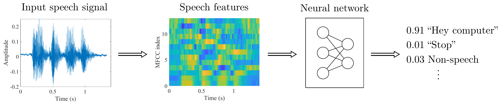

# Wake-word and keyword spotting


Full large-vocabulary speech recognition is unnecessary and far too
expensive for many practical applications. For a table lamp, it would
quite sufficient if it understands "Light off" and "Light on."  Besides,
most of the time, speech devices are just sitting there waiting for
instructions when nobody is speaking. Speech recognition algorithms
moreover use a lot of computational resources such that it would be
wasteful to have them analyse sounds when there is no speech present.
[Voice activity detection (VAD)](Voice_activity_detection_VAD_) takes
care of the first part, to detect whether speech is present or not, such
that all activities are in a sleep mode when speech is not present.

Wake-word and keyword spotting refer to small-vocabulary speech
recognition tasks. They are used either in very simple applications
where proper speech recognition is unnecessarily complex (keyword
spotting), and in pre-processing tasks, where we want to save resources
by waiting for a "Hey computer!". In the latter task, wake-word spotting
is thus a trigger for more complex speech processing tasks. Though the
two tasks have rather different objectives, the underlying technology is
very similar and they will here be discussed jointly.

Most typically wake-word and keyword spotting algorithms run on devices
with limited resources. They can be limited in memory footprint and in
computation resources (CPU power) or often both. Increasing amount of
memory or using a larger CPU would both increase cost of device
(investment cost), but would also require more power (maintenance cost).
In small devices such marginal costs are a very significant part of the
overall cost of the device.


The overall structure of of keyword-spotting algorithms is illustrated
below. The input speech signal is first converted to a feature
representation, such as [MFCCs](Cepstrum_and_MFCC), which are fed to a
[neural network](Neural_networks), and the output is the likelihood of
each keyword.



Adapted from {cite:p}`zhang2017hello`


In other words, keyword and wake-word spotters have a small set of
accepted keywords, which are hard-coded into the software. If we have
*N* possible keywords, then the neural network has *N* outputs
corresponding to the probability that the input is each of those
keywords. The output is then thresholded such that that keyword is
chosen which has the largest probability.


The choice of structure for the neural network is highly dependent on
the device constraints as well as the objective, operating environment
and context of the application. Usually the structure is a deep neural
network featuring some recurrent, convolutional and long-short term
memory (LSTM) components.


A central challenge in training keyword spotting algorithms is finding
and choosing training data. To get good quality, you would typically
need several tens of thousands of utterances of the keywords, spoken by
a large range of different speakers and in different environments. For
example the ["Speech Commands Dataset" by
Google](https://ai.googleblog.com/2017/08/launching-speech-commands-dataset.html)
has 65.000 utterances of 30 short words. However, the choice of keywords
is naturally dependent on those functions that the keyword spotter
should activate, or the desired wake-word. For real-world applications
we therefore often cannot use pre-collected datasets, but have to
collect our own. You can just imagine the workload required to collect
65.000 utterances from over a thousand speakers!


## References

```{bibliography}
:filter: docname in docnames
```
