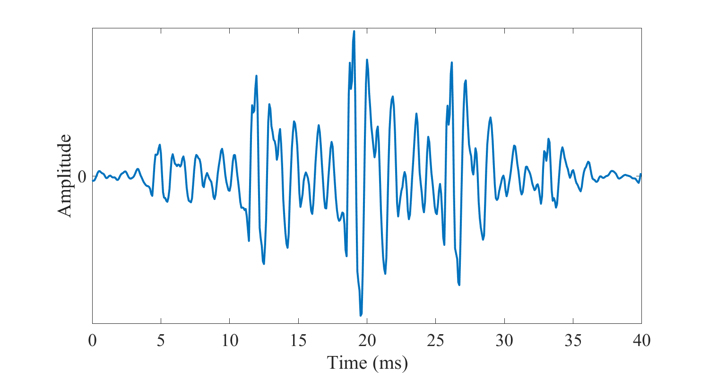
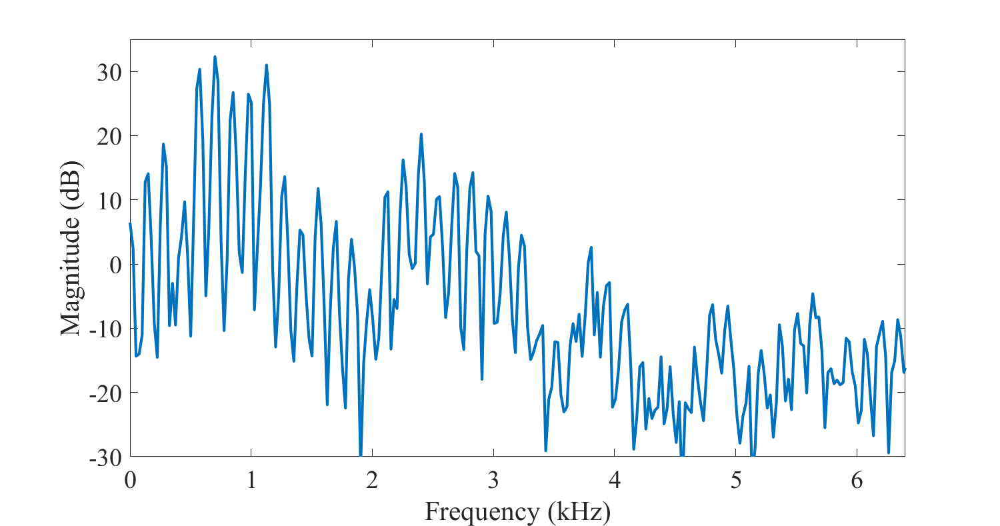
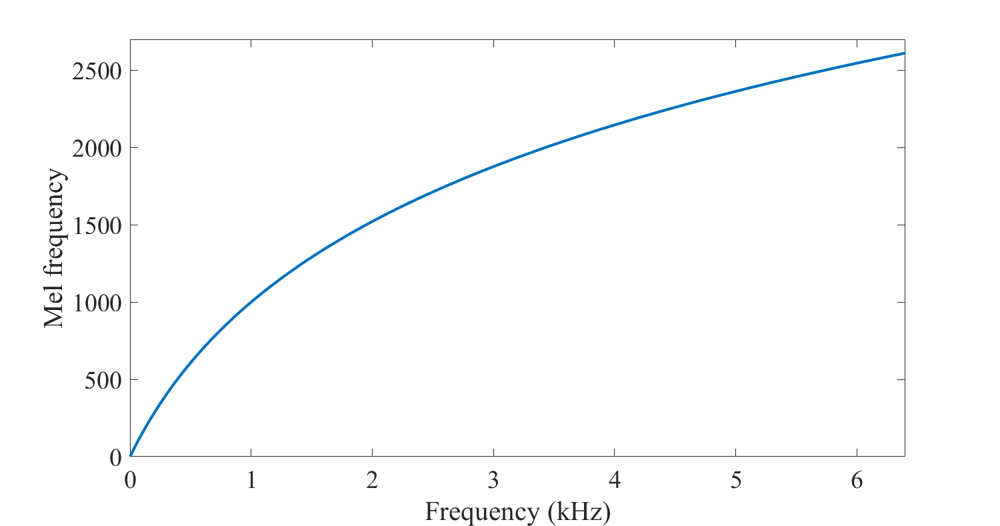
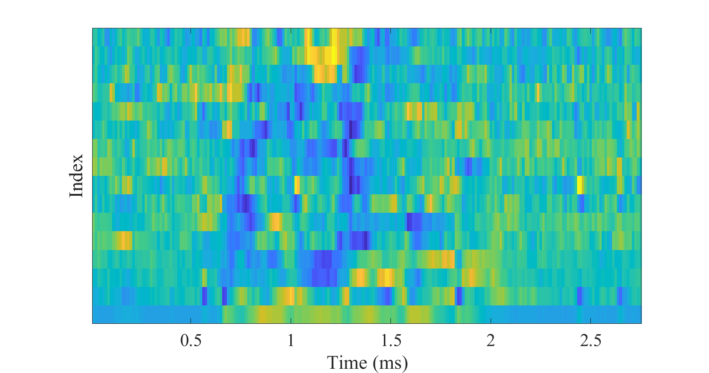

# Cepstrum and MFCC

## Motivation

Power [spectra](Spectrogram_and_the_STFT) of [windows](Windowing) of
speech signals contain information about the most important features of
speech signals like the identity of vowels. Unfortunately, the range of
values is very non-uniform. In fact, by directly looking at power
spectra, we do not really see anything informative. 

The logarithmic spectrum, on the other hand, is a much more accessible
representation. It is not only more visual, but importantly, the
logarithm approximates roughly the sensitivity of the ear, such that
logarithmic spectra can be used to assess auditory importance of
spectral features. The logarithmic spectrum visualizes spectral content
such that the magnitude of values is approximately uniform throughout
the spectrum.

Windowed speech signal 

The only exception is zeros and other very small values in the magnitude
spectrum, which give negative infinities or arbitrarily large negative
values in the log spectrum. Though such values are "difficult" for
visualizations, they are inconsequential for auditory perception and can
be often ignored. However, for computations in the log-spectrum,
arbitrarily large negative values are a problem. 

To reduce the likelihood of such problematic values, we can use for
example an energy bias similar to the [mu-law](Waveform) rule or
integrate energies over frequencies. Specifically, instead of
$y=\log(\|x\|^2)$, we can use $y=\log(\|x\|^2+e)$,
where $e$ is a small positive number. The output $y$ will then never go
lower than a threshold $y\geq \log(e)$. 

In addition, we can integrate (or sum) neighboring frequencies, for
example as

$$
 y_k=\log\left(\gamma\|x_{k-1}\|^2+\|x_k\|^2+\gamma\|x_{k+1}\|^2+\epsilon\right),
$$

where 0\<γ\<1 is a scalar. The likelihood that all three coefficients,
$x_{k-1}$, $x_{k}$ and $x_{k+1}$, are all
simultaneously near zero is much smaller than that one of them is near
zero. The likelihood that $y$ gets near the threshold $y\geq \log(e)$ is
therefore small. Such methods can be used to improve the robustness of
log-spectra, such that we can make computations to them with reliable
results.

Power spectrum of speech
segment 

## The cepstrum

We now see that the log-spectrum has plenty of structure. It is a more
or less continuous signal, owing to a large part, to the smoothing
effect of windowing. In the illustration to the right, it has also a
periodic structure, which corresponds to the harmonic structure of the
signal caused by the fundamental frequency. Importantly, it has also a
macro-level structure; by connecting the peaks of the harmonic
structure, we see that the signal forms peaks and valleys, which
correspond to the resonances of the vocal tract. These peaks are known
as formants and they can be used to uniquely identify all vowels. They
are therefore of particular interest. Capturing or quantifying such
macro-level structures is important because of the connection with the
vowel-identity. 

One way of evaluating periodic structures in a signal on different
scales is to use the Fourier transform. Specifically, we can take the
discrete Fourier transform (DFT) or the discrete cosine transform (DCT)
of the the log-spectrum, to obtain a representation known as
the *cepstrum*. The name attempts to be an amusing reflection of the
fact that this representation is a complicated rearrangement of
time-frequency transforms. In technical terms, for a time signal $x(t)$,
the cepstrum is defined as

$$ \text{power cepstrum of signal} {\displaystyle
=\left\|{\mathcal {F}}^{-1}\left\{\log \left(\left\|{\mathcal
{F}}\{x(t)\}\right\|^{2}\right)\right\}\right\|^{2},} $$

where $ {\mathcal {F}}\{\cdot\} $ represent the Fourier
transform and $ {\mathcal {F}}^{-1}\{\cdot\} $ its inverse.

It is worth repeating that the cepstrum involves two time-frequency
transforms. The cepstrum of a time-signal is therefore in some sense
similar to the time-domain. The x-axis of a cepstrum is known as
the *quefrency-*axis and it is expressed typically in the
unit *seconds. *

In the cepstrum, the low quefrencies contain information about the
slowly-changing features of the log-spectrum. That is, information of
the formants will lie at the low-quefrency end of the cepstrum.
Interpretation of formant information in the cepstrum is, however,
non-trivial. For example, locations of the formants, on the
frequency-axis, are encoded in the cepstrum, but the information is
distributed over several coefficients such that extracting that
information is not easy. 

Log-spectrum of speech
segment 

Cepstrum of speech segment

The most visually prominent feature in this cepstrum is the peak near
quefrency 7 ms. It corresponds to a fundamental frequency of 1000/(7 s)
= 143 Hz. That fundamental frequency is clearly visible also in the
log-spectrum above, where the comb-structure has peaks at approximately
multiples of 143 Hz.

A second useful piece of information in the cepstrum is the harmonic
structure of the log-spectrum. Recall that the fundamental frequency is
visible as a comb-structure in the log-spectrum. The comb-structure, in
turn, is a periodic structure and the Fourier transform is an excellent
tool for extracting such structures. We can thus expect to see a peak in
the cepstrum at the quefrency corresponding to the pitch-period length
(in seconds). If we assume that fundamental frequencies $F_{0}$
are in the range 80 to 450 Hz, then the corresponding peak in the
cepstrum should lie at quefrency $1/F_{0}$ and they range from
2.2 to 12.5 milliseconds. 

Estimating the fundamental frequency in the cepstrum is, in fact, very
simple and relatively robust. We would just need to find the highest
peak of the cepstrum in the appropriate quefrency-range. [Fundamental
frequency estimation](Fundamental_frequency_estimation) will be
discussed further in a separate section.

## Mel-Frequency Cepstral Coefficients (MFCCs)

To further improve on the cepstral representation, we can include more
information about auditory perception into the model. Specifically, by
introducing information about human perception, we focus the model on
that part of the information which human listeners would find important.
The log-spectrum already takes into account perceptual sensitivity on
the magnitude axis, by expressing magnitudes on the logarithmic-axis.
The other dimension is then the frequency axis. 

There exists a multitude of different criteria with which to quantify
accuracy on the frequency scale and there are, correspondingly, a
multitude of perceptually motivated frequency scales including the
[equivalent rectangular
bandwidth](https://en.wikipedia.org/wiki/Equivalent_rectangular_bandwidth)
(ERB) scale, the [Bark](https://en.wikipedia.org/wiki/Bark_scale) scale,
and the [mel](https://en.wikipedia.org/wiki/Mel_scale)-scale. Probably
through an abritrary choice mainly due to tradition, in this context we
will focus on the mel-scale. This scale describes the perceptual
distance between pitches of different frequencies. 

A classical approximation is to define the frequency-to-mel transform
function for a frequency $f $ as

$$ m=2595\,\log_{10}\left(1+\frac f{700}\right). $$

The inverse transform can be readily derived as

$$ f = 700\,\left(10^{\frac m{2595}}-1\right). $$

By taking equally spaced points $m_{k}$, using the above
formula, we can then find frequency points $f_{k }$ whose
perceptual distance is equal. In other words, to sample the log-spectrum
with a perceptual scale, we pick samples at frequencies $f_{k}$.
(An implementation detail is that usually, we want to avoid that the
distance between subsequent $f_{k}$ would be smaller than the
highest distance between harmonic peaks, such that the model focuses on
the macro structure and ignores the fundamental frequency. Usually, a
minimum threshold is therefore applied on $f_{k}$.)

Mel scale

  

However, if we would only pick samples at frequencies $f_{k}$,
we would loose all the other information. Therefore, similarly as in the
frequency-integration approach above, we take a weighted sum of energies
near the target frequency $f_{k}$ as

$$ u_k = \sum_{h=f_{k-1}+1}^{f_{k+1}-1} w_{k,h} \|x_h\|^2, $$

where scalars $w_{k,h}$ are a weighting parameters. Then we get,
simultaneously, the benefit of a robust estimate due to energy
integration, but also apply a perceptual frequency scale.

Finally, by taking the discrete cosine transform (DCT) of the parameters
$u_{k}$, we obtain the representation known as *mel-frequency
cepstral coefficients *(MFCCs). The benefit of the DCT at the end is to
approximately decorrelate the signal, such that the MFC coefficients are
not correlated with each other. 

The weighting coefficients $w_{k,h}$ are usually chosen as
triangular functions as

$$ w_{k,h} = \begin{cases} \frac{h-f_{k-1}}{f_k - f_{k-1}} &
\text{for}\quad f_{k-1} < h\leq f_k, \\ \frac{f_{k+1}
-h}{f_{k+1} - f_{k}} & \text{for}\quad f_{k}< h\leq f_{k+1},
\\0 & \text{otherwise}. \end{cases} $$

The process of acquiring MFCCs from a spectrogram is illustrated on the
right, where on the top, there is a triangular filterbank placed at
linear steps on the mel-frequency scale. The second figure shows the
spectrogram of a speech segment. When each window of that spectrogram is
multiplied with the triangular filterbank, we obtain the mel-weighted
spectrum, illustrated in the third figure. Here we see that the
gross-shape of the spectrogram is retained, but the fine-structure has
been smoothed out. In essence, this process thus removes the details
related to the harmonic structure. Since the identity of phonemes such
as vowels is determined based on macro-shapes in the spectrum, the MFCCs
thus preserve that type of information and remove "unrelated"
information such as the pitch.

The fourth figure illustrates the outcome once the mel-weighted
spectrogram is multiplied with a DCT to obtain the final MFCCs. Where
the mel-weighted spectrogram does retain the original shape of the
spectrum, the MFCCs do not offer such easy interpretations. It is an
abstract domain, which contains information about the spectral envelope
of the speech signal.

  

Though the argumentation for the MFCCs is not without problems, it has
become *the most used feature* in speech and audio recognition
applications. It is used because it works and because it has relatively
low complexity and it is straightforward to implement. Simply stated,

if you're unsure which inputs to give to a speech and audio recognition
engine, try first the MFCCs.

The beneficial properties of the MFCCs include:

-   Quantifies the gross-shape of the spectrum (the spectral envelope),
    which is important in, for example, identification of vowels. At the
    same time, it removes fine spectral structure (micro-level
    structure), which is often less important. It thus focuses on that
    part of the signal which is typically most informative.
-   Straightforward and computationally reasonably efficient
    calculation.
-   Their performance is well-tested and -understood.

Some of the issues with the MFCC include:

-   The choice of perceptual scale is not well-motivated. Scales such as
    the ERB or gamma-tone filterbanks might be better suited. However,
    these alternative filterbanks have not demonstrated consistent
    benefit, whereby the mel-scale has persisted.
-   MFCCs are not robust to noise. That is, the performance of MFCCs in
    presence of additive noise, in comparison to other features, has not
    always been good. 
-   The choice of triangular weighting filters $w_{k,h}$ is
    arbitrary and not based on well-grounded motivations. Alternatives
    have been presented, but they have not gained popularity, probably
    due to minor effect on outcome.
-   The MFCCs work well in analysis but for synthesis, they are
    problematic. Namely, it is difficult to find an inverse transform
    (from MFCCs to power spectra) which is simultaneously unbiased
    (=accurate) and congruent with its physical representation (=power
    spectrum must be positive).

Triangular filterbank $w_{k,h}$
  

Spectrogram of a segment of speech
  

Spectrogram after multiplication with mel-weighted filterbank

  
Corresponding MFCCs
