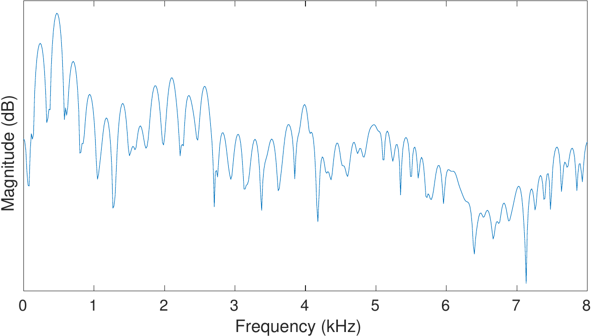

# Signal energy, loudness and decibel

## Signal energy

By signal energy, we usually mean the variance of the signal, which is
the average squared deviation from the mean $
Energy(x)=var(x)=E[(x-\mu)^2], $ where $ \mu=E[x] $ is the
average of the signal *x*. The variance is a measure of energy if we
interpret *x* as the displacement of a pendulum.

Since the amplitude of an oscillating signal varies through the period
of the oscillation, it does not usually make sense to estimate the
instantaneous energy, but only averaged over some [window](Windowing).
Observe however that the windowing function reduces the average energy
(it multiplies the signal by a quantity smaller than unity), which
introduces a bias that should be corrected if an estimate of the
absolute energy is required. Usually, however, the bias is consistent
throughout a dataset and can be ignored.

Typical alternative energy estimates:

-   Energy can be calculated over *spectral bands*, often called energy
    bands, that is, a range of frequencies of a [time-frequency
    transform](Spectrogram_and_the_STFT), such as 0 to 1000 Hz, 1000 Hz
    to 2000 Hz and so one for 1 kHz bands. Observe that the bands should
    be wide enough that they have a "large" number  of frequency
    components within them such that the variance can be estimated. Such
    a representation is equivalent with an spectral envelope model of
    the signal.
-   In a time-frequency representation, the energy of a single frequency
    component can be estimated over time. That is, we can take the
    average energy of a frequency component over several subsequent
    frames or windows.

Observe that since both of these representations are calculated from
windowed signals, they will be similarly biased as the window itself.

## Decibel

A commonly used unit for signal energy is
[decibel](https://en.wikipedia.org/wiki/Decibel) (dB). The formula to
convert a signal energy value $ \sigma^2 $ to decibels is

$$ 10\,\log_{10}\sigma^2. $$

Decibel is thus a logarithmic measure of energy. Trivially, we can
convert this formula also to $ 20\,\log_{10}\sigma $ such that
it relates signal *magnitude* (the standard deviation) $ \sigma $
to the decibel scale.

The benefit of using decibels is that signal energies have often a very
large range. By taking the logarithm, we obtain a representation where
for example visualizations are much easier to handle (see illustration
on the right). Moreover, decibels are also closer to human perception of
acoustic energy.

### Energy normalisation, loudness, dBFS and dBov

In practically all uses of acoustic data, we need to normalize the
sounds such that they have approximately the same volume or at least a
known volume. For example, consider a television program and
advertisements. Most would feel that it is very annoying if the
advertisements are much louder than the main program (see also [loudness
wars](https://en.wikipedia.org/wiki/Loudness_war)). We thus need to
normalize the advertisement to match volume of the main program.
Normalizing the average energy of the advertisement to match that of the
main program is one crude way of doing that. Observe however that
perception of energy is different across frequency ranges such that
energy and the perceived loudness are not the same thing. To measure
loudness we therefore need to model subjective perception. This is an
involved subject and not discussed further here. Practical applications
however still need some normalization to avoid fundamental problems such
as clipping.

The energy measures decibel to overload, *dBov* and decibel to
full-scale, *dBFS,* are related to the dynamic range of a signal storage
or transmission format. Suppose for example that the maximum amplitude
that a digital representation in which a signal is represented is
$x_{ov}$. If we would try to represent a larger amplitude than
that, then the signal would be clipped (distorted). dBov is a measure of
how much below the maximum amplitude (how much below clipping) a signal
is. Suppose $P_{0}$ is the energy of the maximum-amplitude
square wave. Then the dBov of a signal with energy $P$ is defined as

$$ L_{\text{ov}}=10\,\log _{10}\left({\frac
{P}{P_{0}}}\right). $$

Since the energy of a sinusoid with maximum amplitude is $\sqrt{\frac12}$ of the maximum-amplitude square wave, then its dBov
is $-3.01$. Observe that dBov values are always negative. dBFS is a
similar

In typical cases, input speech signals are normalized to $-26$ dBov such
that moderate processing of the signal is unlikely to cause clipping.

  

The energy (power) of a speech signal spectrum (above) and its logarithm
on the decibel scale (lower).

