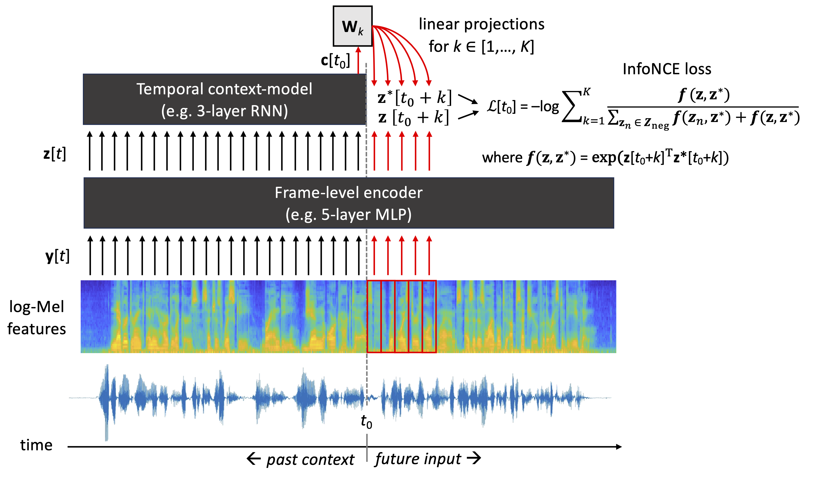

# Self-supervised learning

Self-supervised learning (SSL) refers to a family of machine learning algorithms that are used  to learn useful signal representations from data without any supporting information, such as task-specific data labels. Instead of extracting manually specified signal features, such as MFCCs (see REF), SSL algorithms *learn the features* by taking statistical properties of the input data into acocunt.  The word *useful* refers to signal representations that can act as informative features in a downstream task or a variety of tasks. Alternatively, a pre-trained SSL model can be used as a starting point for model development for a downstream task, such as augmenting the SSL model with a classification layer (or layers) and then fine-tuning the model to a particular speech processing task of interest. 

In general, SSL algorithms belong to the family of unsupervised learning algorithms and they are practically implemented as deep neural networks. The reason they are referred to as *self-supervised* comes from the optimization criterion used to train the models. Classical unsupervised learning operates by performing unsupervised data clustering using a heuristic algorithm (as in k-means) or by modeling the data distribution directly with a generative model (as in Gaussian mixture models, hidden-Markov models, or autoencoders). SSL algorithms, on the other hand, can be viewed as regression models (or classifiers) that try to perform regression from the input data to representations derived from the same input data. 

For instance, in case of speech data, one such a regression task is to predict the spectral envelope of future speech observations, given access to a series of past observations up to present time. When a deep neural network is tasked with this prediction problem and optimized to solve it, the network has to learn higher-level properties of the data in order to solve the problem adequately. Note that the task has to be difficult enough, so that it cannot be solved by trivial means (e.g., linear interpolation from the observed values). Fig. 1 illustrates a self-supervised speech prediction task, as it is implemented in Autoregressive Predictive Coding (APC) algorithm (Chung et al., 2019).   

**Figure 1:** A schematic view of APC model for self-supervised learning. Speech signal is first represented by log-Mel spectral envelope features **y**(t). APC encoder, usually implemented as a multilayer perceptron (MLP), processes each spectral frame one-by-one and transforms them into latent representations **z**(t). The history of **z**(t) values up to present time, $t \in [... ,t_0-2, t_0-1, t_0]$, is processed by a context model (e.g., a RNN, Transformer or CNN), producing a context embedding **c**($t_0$). The context embedding is then projected linearly to produce a prediction  **y***(${t_0}+k$) of a future log-Mel frame **y**(${t_0}+k$) at the given prediction distance *k*. Mean absolute error between the predicted and true future frame is then used as the loss function and minimized during neural network training. After the training, latent vectors **z**(t) or context vectors **c**(t) can be used as inputs to a downstream task.

The advantage of SSL methods is that they do not require labeled data to operate, which allows their training on much larger datasets than what is typically available for a speech processing task. For instance, consider the case of deploying a speech emotion recognition (SER) system for a new use context: There may only be a few hours of representative speech data with emotion labels to train the system. However, there may be hundreds or thousands of hours of unlabeled data available in the same or similar language. By first learning the general characteristics of speech with SSL, and then using the SSL model or its features as the starting point for an emotion classifier, a potentially much more accurate model can be created. In practice, SSL pre-training has turned out to be so useful that a large proportion of modern speech applications, such as automatic speech recognition, nowadays make use of it as an integral part of system development (ref).

## Two basic types of SSL models for speech

State-of-the-art speech SSL models can be characterized by two basic approaches: prediction- and masking-based models. 

### Prediction-based SSL

In the prediction based models, the task of the model is to predict future evolution of the speech signal, given access to a series of past observations. 

In **APC** (Fig. 1), the inputs and prediction targets of the neural network consist of log-Mel features, and the prediction distance *k* (in frames) is a hyperparameter defined by the user.  The model itself consists of ...  [EXPLAIN]

The model is trained by performing predictions for every frame in the training data and using backpropagation to minimize the mean absolute error (MAE) between the predicted and actual future frames. [ADD MATH for loss]
 
**Contrastive Predictive Coding** (CPC; van den Oord et al., 2018) is conceptually similar to APC in terms of predicting future speech using an encoder and a context model. However, instead of predicting spectral envelope of the speech at a single target distance *k*, CPC learns to predict its own latent vectors **z**(*t*+*k*) for all $k \in {1, 2, ..., K}$ and using a separate linear projection **W**$_k$ for each of the prediction distances. This means that CPC learns the predictor and the representations to predict simultaneously during training. When the model is allowed to invent its own prediction targets, conventional distance-based losses (e.g., L1 or L2 loss) cannot be used for model optimization due to the risk of *representation collapse*. During the collapse, the model learns a trivial solution for the problem, such as encoding all speech frames and their predictions with the same constant values. This minimizes the loss very efficiently, but the resulting representations do not carry any information of the underlying signal. In CPC, this is solved by using a so-called *contrastive loss*: instead of minimizing the distance of predicted and true future **z**($t+k$) vectors, the model should learn to distinguish *true future* observations (aka. "positive samples") from other, usually random, observations **z**(*t*) produced by the same encoder ("negative samples"). Technically, this is implemented using a so-called InfoNCE loss:

[ADD InfoNCE MATH]

 
In general, the input signal features and prediction targets can be defined in various ways, depending on the algorithm and aims of the self-supervised learning. For instance, temporal prediction of prosodic parameters can be used to enforce the model to learn prosodic representations for the training language (Juraj ref).

### Masking-based SSL
 

- Masking: Wav2Vec2.0, HuBERT.

## Combining SSL with downstream tasks

Once an SSL model is trained in a self-supervised manner without data labels,  ... SUPERB ref.

## References

Chung, Y.-A., Hsu, W.-N., Tang, H., Glass, J. (2019) An Unsupervised Autoregressive Model for Speech Representation Learning. Proc. Interspeech 2019, 146-150, doi: 10.21437/Interspeech.2019-1473

Yang, S.-w., Chi, P.-H., Chuang, Y.-S., Lai, C.-I.J., Lakhotia, K., Lin, Y.Y., Liu, A.T., Shi, J., Chang, X., Lin, G.-T., Huang, T.-H., Tseng, W.-C., Lee, K.-t., Liu, D.-R., Huang, Z., Dong, S., Li, S.-W., Watanabe, S., Mohamed, A., Lee, H.-y. (2021). SUPERB: Speech Processing Universal PERformance Benchmark. Proc. Interspeech 2021, 1194-1198, doi: 10.21437/Interspeech.2021-1775

APC
Wav2Vec2.0
HuBERT
CPC
Data2Vec2.0

