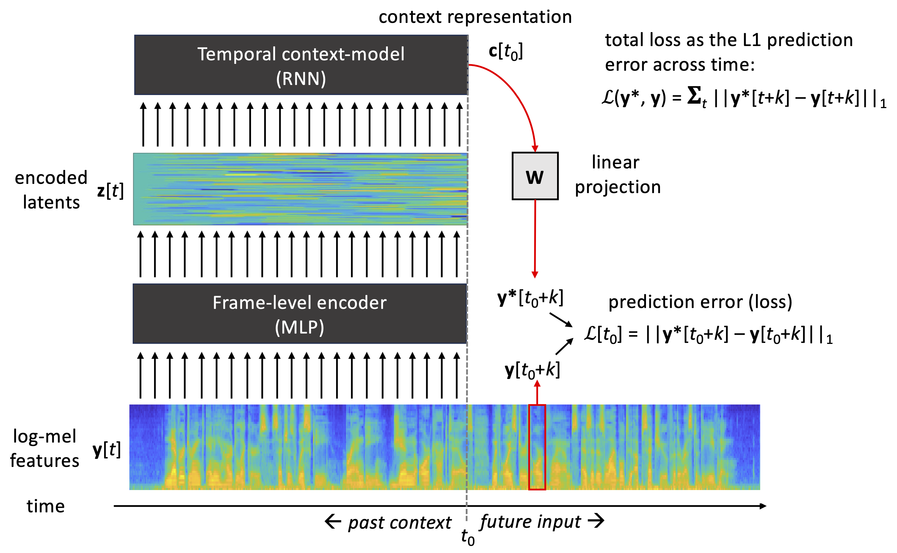
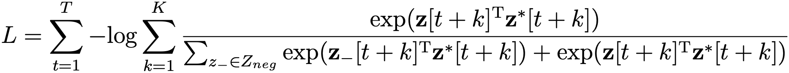
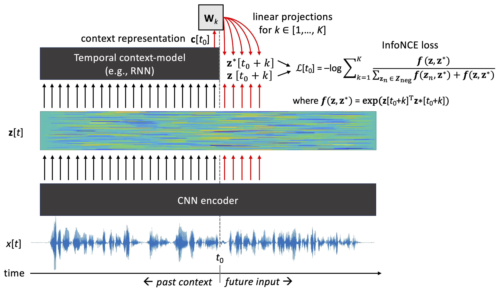
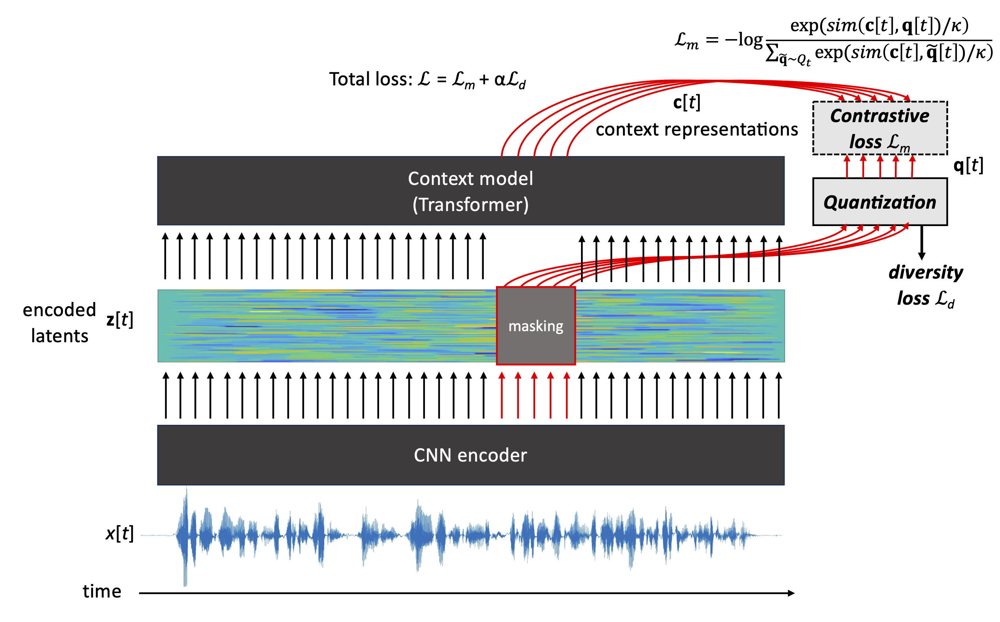
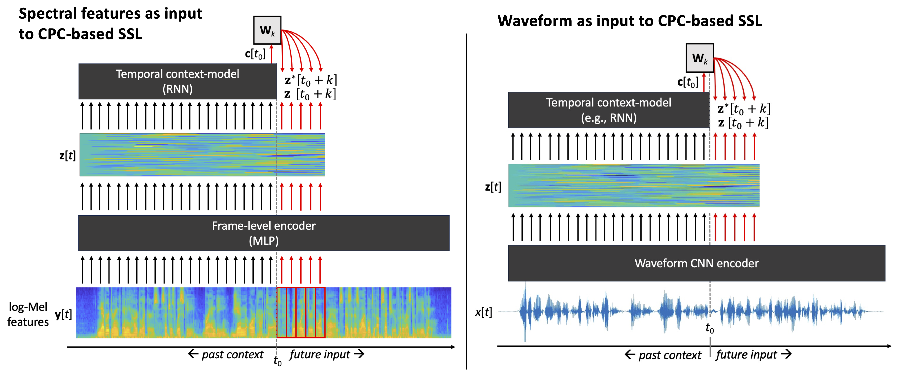

# Self-supervised learning

Self-supervised learning (SSL) refers to a family of artificial neural network models that are used  to learn useful signal representations from data without any supporting information, such as task-specific data labels. Instead of extracting manually specified signal features, such as MFCCs (see REF), SSL algorithms *learn the features* by taking statistical properties of the input data into acocunt.  The concept of *useful features* refers to signal representations that can act as powerful features in a particular downstream task or a variety of tasks, for which labeled training data exists. Besides acting as a feature extractor, a pre-trained SSL model (neural network) can also be used as a model that is then trained for a downstream task. This is usually done by augmenting a trained SSL model with a small number of additional classification layers, and then training the new layers or the entire model to the target task using labeled data related to the task. This process is called model fine-tuning.

In general, SSL algorithms belong to the family of unsupervised learning algorithms and they are practically implemented as deep neural networks. The reason they are referred to as *self-supervised* comes from the optimization criterion used to train the models. Classical unsupervised learning operates by performing unsupervised data clustering using a heuristic algorithm (as in k-means) or by modeling the data distribution directly with a generative model (as in Gaussian mixture models, hidden-Markov models, or autoencoders). SSL algorithms, on the other hand, can be viewed as regression models (or classifiers) that try to perform regression mapping from the input data to model's own internal representations derived from the same input data. 

In case of speech data, one example of a self-supervised regression task is to predict the input speech signal over time. When a deep neural network is tasked with this prediction problem and optimized to solve it, the network has to learn higher-level properties of the data in order to solve the problem adequately. Note that the task has to be difficult enough, so that it cannot be solved by trivial means (e.g., linear interpolation from the observed values). Fig. 1 illustrates a self-supervised speech prediction task, as it is implemented in Autoregressive Predictive Coding (APC) algorithm (Chung et al., 2019). In the APC model, the task of the model is to predict spectral envelope features (e.g., log-Mel spectra or MFCCs) approximately 50 ms in the future, given access to the current and past observations of the input spectrum.   

**Figure 1:** A schematic view of APC model for self-supervised learning. Speech signal is first represented by log-Mel spectral envelope features **y**(t). APC encoder, usually implemented as a multilayer perceptron (MLP), processes each spectral frame one-by-one and transforms them into latent representations **z**(t). The history of **z**(t) values up to present time, $t \in [... ,t_0-2, t_0-1, t_0]$, is processed by a context model (e.g., a RNN, Transformer or CNN), producing a context embedding **c**($t_0$). The context embedding is then projected linearly to produce a prediction  **y***(${t_0}+k$) of a future log-Mel frame **y**(${t_0}+k$) at the given prediction distance *k*. Mean absolute error between the predicted and true future frame is then used as the loss function and minimized during neural network training. After the training, latent vectors **z**(t) or context vectors **c**(t) can be used as inputs to a downstream task.

The advantage of SSL methods is that they do not require labeled data to operate, which allows their training on much larger datasets than what is typically available for a speech processing task. For instance, consider the case of deploying an automatic speech recognition (ASR) system for a new language or dialect: There may only be a few hours of representative speech data with phonemic or text transcriptions to train the system. However, there may be substantially more unlabeled speech data available in the same or similar languages. By first learning the general acoustic and statistical characteristics of speech with SSL, one can then fine-tune the system to connect the learned representations with symbolic linguistic representations of the language. This potentially results in a much more accurate ASR model than what could be achieved by applying normal supervised learning to the small labeled data directly. 

In practice, SSL-based pre-training has turned out to be so powerful that a large proportion of modern speech technology systems make use of it as an integral part of the system development (ref).

## Two basic types of SSL models for speech

State-of-the-art SSL models for speech data can be categorized into two basic approaches: prediction and masking based models. 

### Prediction-based SSL

In the prediction based models, the task of the model is to predict future evolution of the speech signal, given access to a series of past observations. This makes the models causal, as they do not access future speech observations in the generation of their latent representations.

In **APC** (Fig. 1), the inputs and prediction targets of the neural network consist of log-Mel features, and the prediction distance *k* (in frames) is a hyperparameter defined by the user.  The model itself consists of an MLP-encoder to convert the log-Mel features **y** into latent representations **z**, and a temporal context model that is responsible for accumulating the history of ... **z**[*t*-2], **z**[*t*-1], **z**[*t*] into a context vector **c**[*t*]. At every time-step, the context vector is then mapped into a prediction **y***[*t*+*k*] of a future log-Mel frame at *t*+*k* using a learnable linear projection **y***[*t*+*k*]=**c**[*t*]T**W**.

The model is trained by minimizing the mean absolute error (MAE; aka. L1 loss) between the predicted and actual inputs across all data $t \in [1, 2, ..., T]$:

$$L = \sum_{t=1}^T ||\textup{\textbf{y}}^{*}[t+k]-\textup{\textbf{y}}[t+k]||_{1}$$

In the original APC, the encoder was implemented as a 3-layer MLP and the context model was implemented as a stack of LSTM layers (1--4 depending on the configuration) (Chung et al, 2019). The prediction distance *k* was varied from 1 to 20 steps (10-200 ms), with approx. 5 steps (50 ms) being commonly used in later use cases (REFS).

 
**Contrastive Predictive Coding** (CPC; van den Oord et al., 2018) is conceptually similar to APC in terms of predicting future speech using an encoder and a context model. However, instead of predicting spectral envelope of the speech at a single target distance *k*, CPC learns to predict its own latent vectors **z**(*t*+*k*) for all $k \in {1, 2, ..., K}$ and using a separate linear projection **W**$_k$ for each of the prediction distances. This means that CPC learns the predictor and the representations to predict simultaneously during training. When the model is allowed to invent its own prediction targets, conventional distance-based losses (e.g., L1 or L2 loss) cannot be used for model optimization due to the risk of *representation collapse*. During the collapse, the model learns a trivial solution for the problem, such as encoding all speech frames and their predictions with the same constant values. This minimizes the loss very efficiently, but the resulting representations do not carry any information of the underlying signal. In CPC, representation collapse is avoided by using a so-called *contrastive loss*: instead of minimizing the distance of predicted and true future **z**($t+k$) vectors, the model should learn to distinguish *true future* observations (aka. "positive samples") from other, usually random, observations **z**(*t*) produced by the same encoder ("negative samples"). Technically, this is implemented using a so-called InfoNCE loss:

[sample selection etc].

**Figure 2:** [ADD CPC CAPTION]
 

### Masking-based SSL
 
In contrast to temporal prediction SSL models, masking based models attempt to predict parts of input data that are masked (hidden) from the network. In image domain, this would correspond to a learning problem where parts of an image are hidden from the network, and the network has to infer the contents of the hidden area using the surrounding visible parts of the image. In case of speech, the model typically observes several seconds of speech (e.g., an utterance), and then several temporal spans rangin from tens to hundreds of milliseconds in duration are hidden from the model. Similar to CPC (see above), the model's task is then to infer what kind of latent representations the model itself would generate from the masked regions, and doing this by using comparable latent reprensetations derived from the visible parts of the signal.

One example of a masking based SSL is the wav2vec2.0 architecture, which is illustrated in Fig. 3,   

**Figure 3:** An illustration of wav2vec2.0 algorithm by Baevski et al. (2020). A CNN encoder produces latent short-term representations from an input waveform, one latent vector per 10 ms. A subset of these latents is then masked, and the unmasked latents are passed to a Transformer-based context model. In parallel the masked latents are vector quantized (VQ) in a separate processing branch using a learnable codebook. During training time, the model is optimized such that the Transformer correctly predicts the VQ latents of the masked input sections. A separate diversity loss is applied to the VQ to ensure that the quantization results in rich use of the quantization codebook.   

Other popular masking based models include, e.g., HuBERT (ref) and data2vec (ref) algorithms.

## Choosing between waveform and acoustic feature inputs

In the above examples, input to the model is in the form of log-Mel filterbank features, which means that phase information of the signal has been discarded. Also, the less filterbank channels are used, the more the spectral envelope is averaged, which results in some loss of spectral detail, especially at high frequencies.

In theory, use of the original (digitized) acoustic waveform would provide a more general starting point for representation learning. This is since there is no manually introduced loss of signal information before the SSL stage, which may provide additional performance benefits in tasks where the filterbank representation is not optimal. In fact, many of the SSL algorithms have been originally proposed as models that operate directly on the input waveform, typically sampled at 16 kHz. 

In practice, many of the widely used SSL algorithms, such as CPC, Wav2Vec2.0, or HuBERT can use waveform or filterbank features interchangeably. The main difference is the two input types require a different type of encoder (see also Figs. 1–3): 

*A multilayer perceptron (MLP)* can be used for filterbank features, if the features are extracted at a typical frame rate (e.g., one frame every 10 ms). In this case, the goal of the encoder is to perform a non-linear transformation on each of the frames representing spectral envelope of the input to a latent space. In the MLP, processing of each filterbank frame is done independently of the neighboring frames, meaning that the frame rate of the encoder output is the same as in the input. Since the MLP is optimized as a part of the entire SSL model training, it learns to represent filterbank information in a manner that supports the self-supervised learning task. As a concrete example, APC reference implementation uses 3 feed-forward layers with ReLu activations as the encoder for 80-dimensional log-Mel spectrograms (Chung et al., 2019).

*A convolutional neural network (CNN)* is commonly employed as the encoder when waveforms are used as inputs. In this case, the encoder serves two purposes: 1) conversion of the input signal into a form that is useful for the SSL task (as in the filterbank case), and 2) downsampling of the signal from the original waveform sampling rate (e.g., 16 kHz) to a frame-rate compatible with the rest of the architecture and the downstream tasks, such as one frame every 10 ms (the same as in the filterbank case). In other words, CNN can be seen as a learnable non-linear filterbank that replaces FFT magnitude spectrum calculation, filterbank design, and non-linear learnable MLP of the alternative approach. Technically speaking, a typical CNN encoder could consist of 5 CNN layers, where strided convolutions are employed for efficient processing of the time-domain signal, and where the receptive field size of the CNN corresponds to a similar 20--35 ms time-scale as in standard filterbank feature calculation (e.g., van den Oord et al., 2018).

Fig. 4 illustrates the basic structure of MLP (left) and CNN (right) encoders applied to the same input data.     

**Figure 4:** An illustration of CPC algorithm with two types of inputs: spectral features (left) and acoustic waveforms (right). Note the use of CNN encoder for waveforms and MLP for spectral feature frames. The core learning principles of CPC are the same in both cases, but the model naturally cannot recover information lost during the feature extraction process (such as phase information in case of log-Mel features).   

**Advantages of waveform inputs**

- All information in the signal is available to the SSL process, including signal phase and high-frequency details.

**Advantages of filterbank features**

- Discards signal phase, which is not traditionally considered as important for many speech tasks and that tends to vary across recording setups and channels.
- Lower-dimensional input enables simpler models and faster learning, and from potentially smaller data, as the model does not have to learn to interpret time-domain signals. 

 

In general, the input signal features and prediction targets of SSL algorithms can be defined in various ways, depending on the algorithm and aims of the self-supervised learning. For instance, temporal prediction of prosodic parameters can be used to enforce the model to learn prosodic representations for the training language (REF JURAJ et al.).

## Combining SSL with downstream tasks

Once an SSL model is trained in a self-supervised manner without data labels, there are two basic ways to use the model: 1) using the model as a fixed feature extractor to provide speech features for a downstream task, or 2) using the model as a part of an end-to-end downstream task system. 

In the first case, the pre-trained SSL model can simply be used as a feature extraction tool. Speech data is given as an input to the model, and then the corresponding hidden layer activations resulting from the forward pass of the model are extracted as the output features. For instance, in APC and CPC models it is common to extract encoder outputs **z**[*t*] or context vectors  **c**[*t*] as short-term features for the signal at each time-step *t*. However, activations of any hidden layer of an SSL model can be used, and the performance of the resulting features depends on the task and SSL model at hand. Usage of SSL models as frozen feature extractors is also commonly used in benchmarks used to compare performance of different SSL algorithms (SUPERB REF).

In the alternative use of SSL models, the pre-trained layers and weights of an SSL model are included as a part of a downstream task model. Depending on the model and task, it is sometimes possible to directly fine-tune the SSL model to the task by simply adding an appropriate task-specific classification or regression layer after a chosen hidden layer (see the previous paragraph) and then fine-tuning some or all layers of the model using a loss function appropriate for the task. Alternatively, several new trainable layers are connected to the SSL model layers, and some or all of the layers of the resulting combined model are then trained for the task. The advantage of this approach is that the SSL model, including its acoustic encoder, can benefit from the further training that optimizes the entire pipeline for the task at hand. The downside is that fine-tuning the entire model using a dataset of limited size can result in overfitting or catastrophic forgetting in the model. This is especially the case when there is a large number of parameters in the combined pipeline. Different targeted strategies can be applied to mitigate such problems, which are beyond the scope of the present text. 

## Benchmarking SSL models

Given the fast pace of the development of SSL methods, it may be difficult to identify the most suitable method for a particular use case. This is where standardized benchmarks for SSL performance can be of use. One such benchmark is the Speech processing Universal PERformance Benchmark (SUPERB) benchmark (Yang et al., 2021). SUPERB consists of several downstream tasks in which representations from a pre-trained SSL encoder are tested as features. These tasks include automatic speech recognition, phoneme recognition, speaker identification, speaker verification, speaker diarization, speech emotion recognition, and many more. Performance of different SSL methods in these tasks are listed on a leaderboard available at [https://superbbenchmark.org/](https://superbbenchmark.org/), allowing straightforward comparison of alternative methods. 

## References

Chung, Y.-A., Hsu, W.-N., Tang, H., Glass, J. (2019) An Unsupervised Autoregressive Model for Speech Representation Learning. Proc. Interspeech 2019, 146-150, doi: 10.21437/Interspeech.2019-1473

Yang, S.-w., Chi, P.-H., Chuang, Y.-S., Lai, C.-I.J., Lakhotia, K., Lin, Y.Y., Liu, A.T., Shi, J., Chang, X., Lin, G.-T., Huang, T.-H., Tseng, W.-C., Lee, K.-t., Liu, D.-R., Huang, Z., Dong, S., Li, S.-W., Watanabe, S., Mohamed, A., Lee, H.-y. (2021). SUPERB: Speech Processing Universal PERformance Benchmark. Proc. Interspeech 2021, 1194-1198, doi: 10.21437/Interspeech.2021-1775

APC
Wav2Vec2.0
HuBERT
CPC
Data2Vec2.0

