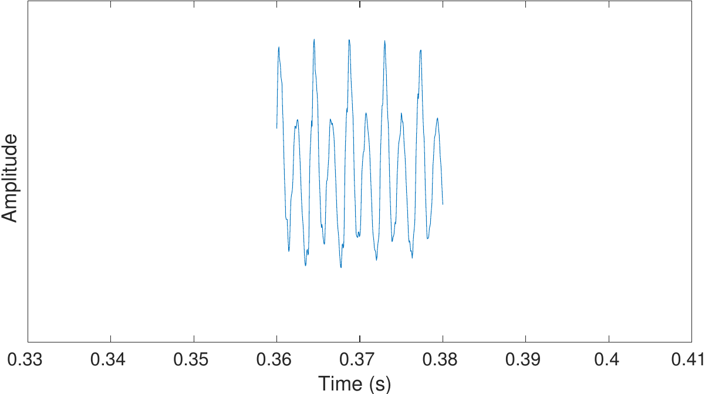
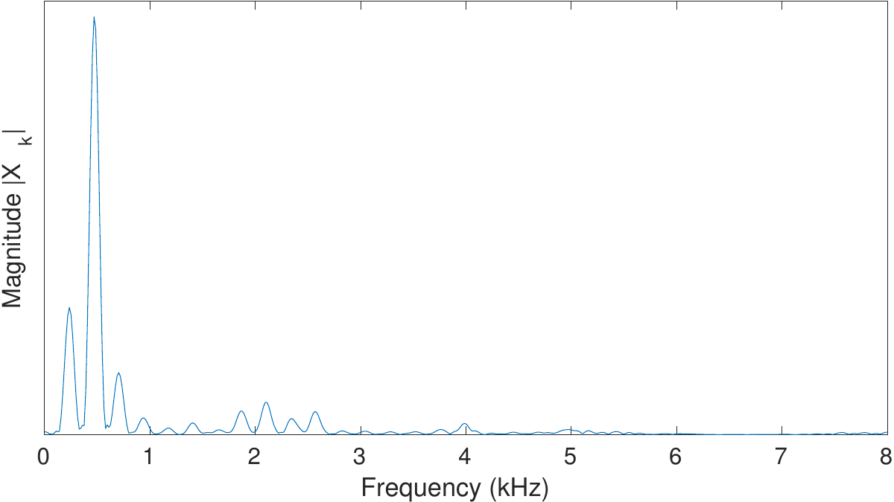

# Spectrogram and the STFT

We have intuitive notion of what a high or low pitch means. Pitch refers
to our perception of the frequency of a tonal sound. The
[Fourier *spectrum*](https://en.wikipedia.org/wiki/Fourier_transform) of
a signal reveals such frequency content. This makes the spectrum an
intuitively pleasing domain to work in, because we can visually examine
signals. 

In practice, we work with discrete-time signals, such that the
corresponding time-frequency transform is the [discrete Fourier
transform](https://en.wikipedia.org/wiki/Discrete_Fourier_transform). It
maps a length *N* signal *xn* into a complex valued frequency
domain representation *Xk* of *N* coefficients as

\\\[ X_k = \\sum\_{n=0}^{N-1}x_n e^{-i2\\pi\\frac{kn}N}. \\\]

For real-valued inputs, positive and negative frequency components are
complex conjugates of each other, such that we retain *N* unique units
of information. However, since spectra are complex-valued vectors, it is
difficult to visualize them as such. A first solution would be to plot
the magnitude spectrum \|*Xk*\| or power
spectrum \|*Xk*\|2 . Due to large differences in
the range of different frequencies, unfortunately these representations
do not easily show relevant information. 

The log-spectrum  \\( 20\\log\_{10}\|X_k\| \\) is the most common
visualization of spectra and it gives the spectrum in decibels. It is
useful because again, it gives a visualization where sounds can be
easily interpreted. 

Since Fourier transforms are covered by basic works in signal
processing, we will here assume that readers are familiar with the basic
properties of these transforms.

Speech segment

Windowed speech segment

Magnitude of DFT of speech segment

Power of DFT of speech segment

Log-spectrum of speech segment

------------------------------------------------------------------------

Speech signals are however non-stationary signals. If we transform a
spoken sentence to the frequency domain, we obtain a spectrum which is
an average of all phonemes in the sentence, whereas often we would like
to see the spectrum of each individual phoneme separately. 

By splitting the signal into shorter segments, we can focus on signal
properties at a particular point in time. Such segmentation was already
discussed in the *[windowing](Windowing)* section. 

By windowing and taking the discrete Fourier transform (DFT) of each
window, we obtain the [*short-time Fourier
transform*](https://en.wikipedia.org/wiki/Short-time_Fourier_transform)
(STFT) of the signal. Specifically, for an input signal
*xn *and window *wn*, the transform is defined as

\\\[ STFT\\{x_n\\}(h,k) = X(h,k) = \\sum\_{n=0}^{N-1} x\_{n+h} w_n
e^{-i2\\pi\\frac{kn}N}. \\\]

The STFT is one of the most frequently used tools in speech analysis and
processing. It describes the evolution of frequency components over
time. Like the spectrum itself, one of the benefits of STFTs is that its
parameters have a physical and intuitive interpretation.

A further parallel with a spectrum is that the output of the STFT is
complex-valued, though where the spectrum is a vector, the STFT output
is a matrix. As a consequence, we cannot directly visualize the
complex-valued output. Instead, STFTs are usually visualized using their
log-spectra,  \\( 20\\log\_{10}(X(h,k)). \\) Such 2 dimensional
log-spectra can then be visualized with a heat-map known as
a *[spectrogram](https://en.wikipedia.org/wiki/Spectrogram)*.

------------------------------------------------------------------------

When looking at speech in a spectrogram, like the figure on the right,
depicting a sentence "*Sound Example*", many important features of the
signal can be clearly observed:

-   Horizontal lines in a comb-structure correspond to the fundamental
    frequency. For example, in the figure on the right, at 0.5 s there
    is the vowel /e/ and /a/ at 1.3 s which has clear horizontal lines.
-   Vertical lines correspond to abrupt sounds, which are often
    characterized as transients. Typical transients in speech are stop
    consonants. In the figure on the right, there is a /d/ at 0.8 s and
    /ks/ at 1 s.
-   Areas which have a lot of energy in the high frequencies (appears as
    a lighter colour), like at approximately 0.3 s in the figure on the
    right, correspond to noisy sounds like fricatives. In the figure on
    the right we can found the /s/ sound at both 0.3 and 1.1 s.

  

  

A speech signal and its spectrogram

## Attachments:

[sample_window-1.png](attachments/148296298/149882932.png) (image/png)  

[sample_windowed-1.png](attachments/148296298/149882933.png)
(image/png)  

[sample_windowed_dft2-1.png](attachments/148296298/149882934.png)
(image/png)  

[sample_windowed_dft-1.png](attachments/148296298/149882935.png)
(image/png)  

[sample_windowed_dftdb-1.png](attachments/148296298/149882936.png)
(image/png)  

[spectrogram.png](attachments/148296298/149883065.png) (image/png)  

[spectrogram.png](attachments/148296298/149883067.png) (image/png)  

[spectrogram.png](attachments/148296298/149883027.png) (image/png)  

