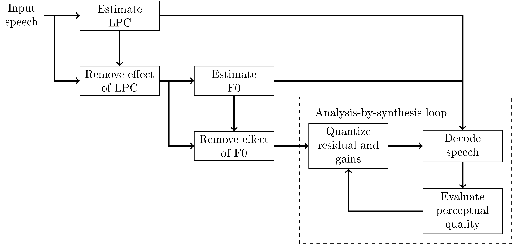

(content:CELP)=
# Code-excited linear prediction (CELP)

The most famous speech coding paradigm is code-excited linear prediction
(CELP). It was first invented in 1985 and is the basis of all
main-stream codecs dedicated to speech. Its most prominent variant is
the algebraic CELP, which uses an algebraic codebook to encode the noise
residual. Codecs such as
[AMR](https://en.wikipedia.org/wiki/Adaptive_Multi-Rate_audio_codec),
[EVS](https://en.wikipedia.org/wiki/Enhanced_Voice_Services),
[G.718](https://en.wikipedia.org/wiki/G.718) and
[Speex](https://en.wikipedia.org/wiki/Speex) (superseded by
[Opus](https://en.wikipedia.org/wiki/Opus_(audio_format))) are all based
on variants of CELP.

As an overview, CELP is based on a source-filter model of speech, where
[linear prediction](Linear_prediction) is used to model the filtering
effect of the vocal tract (and other effects) and this filter is excited
by the speech source, viz. the glottal source and turbulent noise.
Typically, the [pitch or fundamental frequency
model](Fundamental_frequency_F0_) is a long-term prediction (LTP)
filter, which is just a linear predictor with a long delay. To model
noise, CELP codecs usually use a [vector
codebook](Vector_quantization_VQ_). The codebook contribution is often
optimized with analysis-by-synthesis, where the output of different
quantizations are synthesised and the synthesised outputs are evaluated
to choose the best quantization. The evaluation uses [perceptual
weighting](Perceptual_modelling_in_speech_and_audio_coding) such that
the subjective, perceptual quality can be compared.

Since [linear prediction](Linear_prediction) and [fundamental frequency
modelling](Fundamental_frequency_F0_) are described in detail elsewhere,
below we will discuss only overall encoder/decoder structure, perceptual
evaluation, noise modelling and analysis-by-synthesis.

 
The source-filter model of CELP codecs.

## Encoder/decoder structure

The decoder (see image on the right) very closely implements the idea of
the source-filter model (see above). The only refinement are two
multiplications with scalar gains, where the noise codebook and pitch
contribution are scaled to the desired magnitude. Observe that here we
abbreviate linear predictive coding with LPC.

The encoder and decoder typically operate in frames of 20 ms length,
which are further subdivided into 5 ms subframes. Operations described
above are thus performed on vectors whose length correspond to 5 ms,
which at a sampling-rate of 12.8 kHz corresponds to 64 samples.

The encoder (see figure on the right) first estimate the linear
predictive (LPC) model, then removes its effect from the input. In other
words, since linear prediction is IIR-filtering, we can remove the
effect from the speech signal with the corresponding FIR-filter to
obtain the LPC-residual. We can then similarly estimate the fundamental
frequency (F0) from the residual and again remove its effect to obtain
the F0-residual.

The F0-residual closely resembles white noise (following the Laplacian
distribution). We can thus quantize it with a noise-quantizer (described
below) as well as the pitch and noise gains. To evaluate the output
quality of the signal, we then decode the quantized signal and calculate
a perceptually weighted error. Since LPC-filtering is autoregressive
(IIR), it however has a non-linear effect on the output such that
quantization has a non-linear effect on the output. We therefore cannot
know which quantization is the best one without trying out *all of
them*. To get best possible performance, in theory, we should try every
possible quantization! However, in practice, we choose a group of
potentially-good quantization and find the best out of them. This is
known as the *analysis-by-synthesis* method.

Analysis-by-synthesis is a celebrated method because it enables
optimization of CELP and achieves relatively high quality. Since CELP is
arguably more efficient than competing frequency-domain codecs, and
analysis-by-synthesis enables optimization of CELPs, it is important.
However, observe that this is a brute-force method, which has an
inherent penalty in computational complexity.

CELP decoder structure

  

CELP encoder structure

## Perceptual quality evaluation

Perceptual quality in CELP codecs is evaluated with a weighted norm.
Suppose $W$ is a convolution matrix corresponding to the perceptual
weighting filter, then the weighted norm between the true and quantized
residual signals $x$ and $ \hat x $ , respectively, is

$$ d_W(x,\hat x):=\left\| W(x-\hat x)\right\|^2 = (x-\hat
x)^T W^T W (x-\hat x). $$

Though this is a quadratic form, whose minimization is simple, notice
that we consider quantized vectors, such that the minimization is an
integer-valued minimization problem, which does not have an analytic
solution.

Further, the quantized signal is the sum of noise and pitch
contributions, both multiplied with scaling factors

$$ \hat x := \gamma_{F0} x_{F0} + \gamma_{noise} x_{noise}.
$$

When estimating the F0, we can set the noise contribution to zero, such
that we minimize

$$ \arg\min_{x_{F0}}\, d_W(x,\gamma_{F0}x_{F0}):=
\arg\min_{x_{F0}}(x-\gamma_{F0}x_{F0})^T W^T W
(x-\gamma_{F0}x_{F0}). $$

To compare different pitch contributions, we further need to exclude the
gain from the problem, which is achieved by setting the derivative with
respect to $ \gamma_{F0} $ to zero (left as an exercises), which
gives the optimal gain as

$$ \gamma_{F0}^* = \frac{x^TW^T W x_{F0}}{x_{F0}^TW^T W
x_{F0}}. $$

Substituting back to the original problem, after removing constants,
yields

$$ x_{F0}^*:=\arg\min_{x_{F0}}\,
d_W(x,\gamma_{F0}^*x_{F0}):= \arg\max_{x_{F0}}
\frac{\left(x^TW^T W x_{F0}\right)^2}{x_{F0}^TW^T W x_{F0}}. $$

Observe that this equation thus evaluates the weighted correlation
between the original signal $x$ and the pitch contribution. In other
words, different F0's can be evaluated with this function and the one
with the highest correlation is chosen as the F0.

Once the F0 has been chosen, we calculate the optimal gain and subtract
it from the original residual signal, $ x':=x - \gamma_{F0}^*
x_{F0}^*. $ This F0-residual is then approximately white noise and
can be modelled with the noise codebook. Similarly as above, we assume
that the noise-gain is optimal such that the noise codebook can be
optimized with

$$ \gamma_{noise}^* = \frac{x^TW^T W x_{noise}}{x_{noise}^TW^T W
x_{noise}} $$

and

$$ x_{noise}^*:=\arg\min_{x_{noise}}\,
d_W(x',\gamma_{noise}^*x_{noise}):= \arg\max_{x_{noise}}
\frac{\left(x^TW^T W x_{noise}\right)^2}{x_{noise}^TW^T W
x_{noise}}. $$

We have thus quantized the pitch and noise contributions, but for the
two gains we have optimal values, but not optimal *quantized* values.
Again, since quantized values are not continuous, we do not have an
analytic solution but must search for the best quantization among all
possible values. The optimization problem is

$$ \arg\min_{\gamma_{F0},\gamma_{noise}}\,
d_W(x,\gamma_{F0}x_{F0}^* + \gamma_{noise}x_{noise}^*) =
\arg\min_{\gamma_{F0},\gamma_{noise}}\,(x-\gamma_{F0}x_{F0}^* -
\gamma_{noise}x_{noise}^*)^T W^T W (x-\gamma_{F0}x_{F0}^* -
\gamma_{noise}x_{noise}^*). $$

We note that the above equation is a polynomial of the two scalar gains
and all vector and matrix terms reduce to constants, such that

$$ \arg\min_{\gamma_{F0},\gamma_{noise}}\,
d_W(x,\gamma_{F0}x_{F0}^* + \gamma_{noise}x_{noise}^*) = c_0 +
\gamma_{F0}c_1 + \gamma_{F0}^2c_2 +\gamma_{noise}c_3 +
\gamma_{noise}\gamma_{F0}c_4 + \gamma_{noise}^2c_5. $$

In difference to the optimization of the residual vectors, this
optimization is computationally relatively simple such that we can
exhaustively search for the best gains. The gains are usually quantized
with 8 to 10 bits, such that this involves only 256 to 1024 polynomial
evaluations.  
The final quantized residual is then

$$ \hat x^* = \gamma_{F0}^* x_{F0}^* + \gamma_{noise}^*
x_{noise}^*. $$

## Noise modelling and algebraic coding

As mentioned above, the residual after LPC filtering and F0 modelling is
approximately stationary white noise, that is, it is constant variance
and samples are uncorrelated. We would like to quantize this
effectively. White noise signals have however no structure left, except
their probability distribution. We can assume that the residual samples
$ \xi_k $ follow the Laplacian distribution with zero mean,

$$ f(\xi_k)= C \exp\left(-\frac{\|\xi_k\|}{s}\right). $$

The joint log-likelihood is

$$ \log\prod_k f(\xi_k)= C'- \sum_k\frac{\|\xi_k\|}{s} = C' -
\frac1s \|x_{noise}\|_1, $$

where $ x_{noise}:= [\xi_1,\dotsc,\,\xi_{K}]. $ and $
\|x\|_1 $ is the 1-norm (absolute sum). In other words, if we
model constant-probability vectors $ x_{noise}, $  then that is
equivalent with modelling vectors with a constant 1-norm, $
\|x_{noise}\|_1=\text{constant}. $ We can thus build a codebook
which has constant 1-norm. For example, if we quantize to integer
values, then the absolute sum of the quantized signal is a fixed
integer.

In the simplest case, we can quantize $ x_{noise} $ to have one
signed pulse at location $k$, and otherwise all samples are zero. The
location of the pulse can be encoded with $ \log_2 K $ bits, and
the sign with one bit, such that the overall bit-consumption is $
1+\log_2 K. $ This encoding strategy can be readily extended by
adding more pulses. The bit-consumption of multi-pulse vectors however
becomes more complicated. The issue is that if apply a naive encoding
where we directly encode the position and sign of each pulse, then we
use more bits than necessary for two reasons. Firstly, if two pulses
overlap, then they must have the same sign otherwise they would cancel.
Secondly, pulses are indistinguishable, such that their ordering does
not matter, such that if we encode pulses one by one, changing their
order would give different bit-streams but the encoded signal would
remain the same. Both imply that we are using too many bits when using
such encodings for multiple pulses. Solutions exist for optimal encoding
of such multi-pulse vectors, but the algorithm becomes involved.

In any case, the outcome is that it is possible to generate
quantizations of residual signals with algorithmic methods. That is, we
have an algorithm or algebraic rule which defines all possible
quantizations and consequently, such quantization is known as algebraic
coding. The encoding can be chosen to have optimal bit-consumption for a
given number of pulses and it is thus (with loose assumptions) the best
possible quantization for the residual vector when using a fixed
bitrate. It is computationally efficient since the residual vectors are
mostly zeros, such that evaluation of the optimization function is
straightforward to calculate. It also efficient in the sense that
codebooks do not have to be stored, but can be generated on the fly by
an algorithm.

Algebraic coding is so central to CELP codecs that CELP codecs using
algebraic coding are known as algebraic CELP or ACELP. Most main stream
codecs, such as AMR, EVS and USAC use ACELP. Some codecs use also other
residual codebooks, but even then, algebraic codes are always the first
choice.

